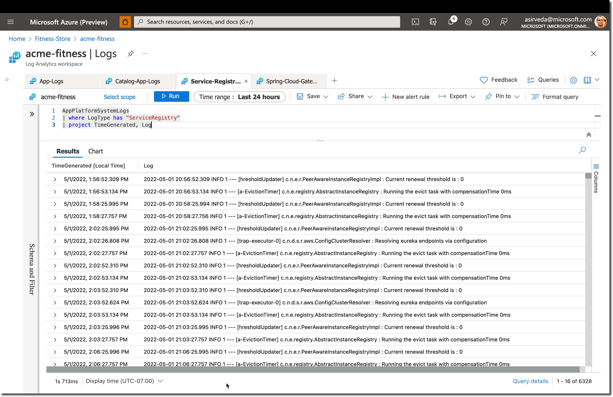

# Deploy Spring Boot Apps to Azure

Azure Spring Apps enables you to easily run Spring Boot and polyglot applications on Azure.

This quickstart shows you how to deploy existing applications written in Java, Python, and C# to Azure. When you're 
finished, you can continue to manage the application via the Azure CLI or switch to using the Azure Portal.

* [Deploy Applications to Azure Spring Apps](#deploy-spring-boot-apps-to-azure)
  * [What will you experience](#what-will-you-experience)
  * [What you will need](#what-you-will-need)
  * [Install the Azure CLI extension](#install-the-azure-cli-extension)
  * [Clone the repo](#clone-the-repo)
  * [Unit 1 - Deploy and Build Applications](#unit-1---deploy-and-build-applications)
  * [Unit 2 - Configure Single Sign On](#unit-2---configure-single-sign-on)
  * [Unit 3 - Integrate with Azure Database for PostgreSQL and Azure Cache for Redis](#unit-3---integrate-with-azure-database-for-postgresql-and-azure-cache-for-redis)
  * [Unit 4 - Securely Load Application Secrets](#unit-4---securely-load-application-secrets)
  * [Unit 5 - Monitor End-to-End](#unit-5---monitor-end-to-end)
  * [Unit 6 - Set Request Rate Limits](#unit-6---set-request-rate-limits)
  * [Unit 7 - Automate from idea to production](#unit-7---automate-from-idea-to-production)

## What will you experience

You will:

* Provision an Azure Spring Apps service instance.
* Configure Application Configuration Service repositories
* Deploy polyglot applications to Azure and build using Tanzu Build Service
* Configure routing to the applications using Spring Cloud Gateway
* Open the application
* Explore the application API with Api Portal
* Configure Single Sign On (SSO) for the application
* Monitor applications
* Automate provisioning and deployments using GitHub Actions

The following diagram shows the architecture of the ACME Fitness Store that will be used for this guide:


This application is composed of several services:

* 3 Java Spring Boot applications:
  * A catalog service for fetching available products
  * A payment service for processing and approving payments for users' orders
  * An identity service for referencing the authenticated user

* 1 Python application:
  * A cart service for managing a users' items that have been selected for purchase

* 1 ASP.NET Core applications:
  * An order service for placing orders to buy products that are in the users' carts

* 1 NodeJS and static HTML Application
  * A frontend shopping application

## What you will need

In order to deploy a Java app to cloud, you need
an Azure subscription. If you do not already have an Azure
subscription, you can activate your
[MSDN subscriber benefits](https://azure.microsoft.com/pricing/member-offers/msdn-benefits-details/)
or sign up for a
[free Azure account]((https://azure.microsoft.com/free/)).

In addition, you will need the following:

| [Azure CLI version 2.17.1 or higher](https://docs.microsoft.com/cli/azure/install-azure-cli?view=azure-cli-latest)
| [Git](https://git-scm.com/)
| [`jq` utility](https://stedolan.github.io/jq/download/)
|

Note -  On Windows, the [`jq` utility](https://stedolan.github.io/jq/download/) should be renamed from `jq-win64.exe` to `jq.exe` and added to the `PATH`

Note - The Bash shell. While Azure CLI should behave identically on all environments, shell
semantics vary. Therefore, only bash can be used with the commands in this repo.
To complete these repo steps on Windows, use Git Bash that accompanies the Windows distribution of
Git. Use only Git Bash to complete this training on Windows. Do not use WSL.

### OR Use Azure Cloud Shell

Or, you can use the Azure Cloud Shell. Azure hosts Azure Cloud Shell, an interactive shell
environment that you can use through your browser. You can use the Bash with Cloud Shell
to work with Azure services. You can use the Cloud Shell pre-installed commands to run the
code in this README without having to install anything on your local environment. To start Azure
Cloud Shell: go to [https://shell.azure.com](https://shell.azure.com), or select the
Launch Cloud Shell button to open Cloud Shell in your browser.

To run the code in this article in Azure Cloud Shell:

1. Start Cloud Shell.

2. Select the Copy button on a code block to copy the code.

3. Paste the code into the Cloud Shell session by selecting Ctrl+Shift+V on Windows and Linux or by selecting Cmd+Shift+V on macOS.

4. Select Enter to run the code.

## Install the Azure CLI extension

Install the Azure Spring Apps extension for the Azure CLI using the following command

```shell
az extension add --name spring
```

Note - `spring-cloud` CLI extension `3.0.0` or later is a pre-requisite to enable the
latest Enterprise tier functionality to configure VMware Tanzu Components. Use the following
command to remove previous versions and install the latest Enterprise tier extension:

```shell
az extension remove --name spring-cloud
az extension add --name spring
```

If `spring-cloud`'s version still < `3.0.0` after above commands, you can try to [re-install Azure CLI](https://docs.microsoft.com/en-us/cli/azure/install-azure-cli). 

## Clone the repo

### Create a new folder and clone the sample app repository to your Azure Cloud account

```shell
mkdir source-code
cd source-code
git clone https://github.com/Azure-Samples/acme-fitness-store
cd acme-fitness-store
```

## Unit 1 - Deploy and Build Applications

### Prepare your environment for deployments

Create a bash script with environment variables by making a copy of the supplied template:

```shell
cp ./azure/setup-env-variables-template.sh ./azure/setup-env-variables.sh
```

Open `./azure/setup-env-variables.sh` and enter the following information:

```shell
export SUBSCRIPTION=subscription-id                 # replace it with your subscription-id
export RESOURCE_GROUP=resource-group-name           # existing resource group or one that will be created in next steps
export SPRING_APPS_SERVICE=azure-spring-apps-name   # name of the service that will be created in the next steps
export LOG_ANALYTICS_WORKSPACE=log-analytics-name   # existing workspace or one that will be created in next steps
export REGION=region-name                           # choose a region with Enterprise tier support
```

The REGION value should be one of available regions for Azure Spring Apps (e.g. eastus). Please visit [here](https://azure.microsoft.com/en-us/global-infrastructure/services/?products=spring-apps&regions=all) for all available regions for Azure Spring Apps.

Then, set the environment:

```shell
source ./azure/setup-env-variables.sh
```

### Login to Azure

Login to the Azure CLI and choose your active subscription. 

```shell
az login
az account list -o table
az account set --subscription ${SUBSCRIPTION}
```

### Create Azure Spring Apps service instance

Prepare a name for your Azure Spring Apps service.  The name must be between 4 and 32 characters long and can contain only lowercase letters, numbers, and hyphens.  The first character of the service name must be a letter and the last character must be either a letter or a number.

Create a resource group to contain your Azure Spring Apps service.

> Note: This step can be skipped if using an existing resource group

```shell
az group create --name ${RESOURCE_GROUP} \
    --location ${REGION}
```

Accept the legal terms and privacy statements for the Enterprise tier.

> Note: This step is necessary only if your subscription has never been used to create an Enterprise tier instance of Azure Spring Apps.

```shell
az provider register --namespace Microsoft.SaaS
az term accept --publisher vmware-inc --product azure-spring-cloud-vmware-tanzu-2 --plan tanzu-asc-ent-mtr
```

Create an instance of Azure Spring Apps Enterprise.

```shell
az spring create --name ${SPRING_APPS_SERVICE} \
    --resource-group ${RESOURCE_GROUP} \
    --location ${REGION} \
    --sku Enterprise \
    --enable-application-configuration-service \
    --enable-service-registry \
    --enable-gateway \
    --enable-api-portal \
    --build-pool-size S2 
```

> Note: The service instance will take around 10-15 minutes to deploy.

Set your default resource group name and cluster name using the following commands:

```shell
az configure --defaults \
    group=${RESOURCE_GROUP} \
    location=${REGION} \
    spring=${SPRING_APPS_SERVICE}
```

### Configure Log Analytics for Azure Spring Apps

Create a Log Analytics Workspace to be used for your Azure Spring Apps service.

> Note: This step can be skipped if using an existing workspace

```shell
az monitor log-analytics workspace create \
  --workspace-name ${LOG_ANALYTICS_WORKSPACE} \
  --location ${REGION} \
  --resource-group ${RESOURCE_GROUP}   
```

Retrieve the resource ID for the recently create Azure Spring Apps Service and Log Analytics Workspace:

```shell
export LOG_ANALYTICS_RESOURCE_ID=$(az monitor log-analytics workspace show \
    --resource-group ${RESOURCE_GROUP} \
    --workspace-name ${LOG_ANALYTICS_WORKSPACE} | jq -r '.id')

export SPRING_APPS_RESOURCE_ID=$(az spring show \
    --name ${SPRING_APPS_SERVICE} \
    --resource-group ${RESOURCE_GROUP} | jq -r '.id')
```

Configure diagnostic settings for the Azure Spring Apps Service:

```shell
az monitor diagnostic-settings create --name "send-logs-and-metrics-to-log-analytics" \
    --resource ${SPRING_APPS_RESOURCE_ID} \
    --workspace ${LOG_ANALYTICS_RESOURCE_ID} \
    --logs '[
         {
           "category": "ApplicationConsole",
           "enabled": true,
           "retentionPolicy": {
             "enabled": false,
             "days": 0
           }
         },
         {
            "category": "SystemLogs",
            "enabled": true,
            "retentionPolicy": {
              "enabled": false,
              "days": 0
            }
          },
         {
            "category": "IngressLogs",
            "enabled": true,
            "retentionPolicy": {
              "enabled": false,
              "days": 0
             }
           }
       ]' \
       --metrics '[
         {
           "category": "AllMetrics",
           "enabled": true,
           "retentionPolicy": {
             "enabled": false,
             "days": 0
           }
         }
       ]'
```

> Note: For Git Bash users, this command may fail when resource IDs are misinterpreted as file paths because they begin with `/`. 
> 
> If the above command fails, try setting MSYS_NO_PATHCONV using:
> 
> `export MSYS_NO_PATHCONV=1`

### Configure Application Configuration Service

Create a configuration repository for Application Configuration Service using the Azure CLI:

```shell
az spring application-configuration-service git repo add --name acme-fitness-store-config \
    --label main \
    --patterns "catalog/default,catalog/key-vault,identity/default,identity/key-vault,payment/default" \
    --uri "https://github.com/Azure-Samples/acme-fitness-store-config"
```

### Configure Tanzu Build Service

Create a custom builder in Tanzu Build Service using the Azure CLI:

```shell
az spring build-service builder create -n ${CUSTOM_BUILDER} \
    --builder-file azure/builder.json \
    --no-wait
```

### Create applications in Azure Spring Apps

Create an application for each service:

```shell
az spring app create --name ${CART_SERVICE_APP} --instance-count 1 --memory 1Gi &
az spring app create --name ${ORDER_SERVICE_APP} --instance-count 1 --memory 1Gi &
az spring app create --name ${PAYMENT_SERVICE_APP} --instance-count 1 --memory 1Gi &
az spring app create --name ${CATALOG_SERVICE_APP} --instance-count 1 --memory 1Gi &
az spring app create --name ${FRONTEND_APP} --instance-count 1 --memory 1Gi &
wait
```

### Bind to Application Configuration Service

Several applications require configuration from Application Configuration Service, so create
the bindings:

```shell
az spring application-configuration-service bind --app ${PAYMENT_SERVICE_APP}
az spring application-configuration-service bind --app ${CATALOG_SERVICE_APP}
```

### Bind to Service Registry

Several application require service discovery using Service Registry, so create
the bindings:

```shell
az spring service-registry bind --app ${PAYMENT_SERVICE_APP}
az spring service-registry bind --app ${CATALOG_SERVICE_APP}
```

### Configure Spring Cloud Gateway

Assign an endpoint and update the Spring Cloud Gateway configuration with API
information:

```shell
az spring gateway update --assign-endpoint true
export GATEWAY_URL=$(az spring gateway show | jq -r '.properties.url')
    
az spring gateway update \
    --api-description "Acme Fitness Store API" \
    --api-title "Acme Fitness Store" \
    --api-version "v1.0" \
    --server-url "https://${GATEWAY_URL}" \
    --allowed-origins "*" \
    --no-wait
```

Create  routing rules for the applications:

```shell
az spring gateway route-config create \
    --name ${CART_SERVICE_APP} \
    --app-name ${CART_SERVICE_APP} \
    --routes-file azure/routes/cart-service.json
    
az spring gateway route-config create \
    --name ${ORDER_SERVICE_APP} \
    --app-name ${ORDER_SERVICE_APP} \
    --routes-file azure/routes/order-service.json

az spring gateway route-config create \
    --name ${CATALOG_SERVICE_APP} \
    --app-name ${CATALOG_SERVICE_APP} \
    --routes-file azure/routes/catalog-service.json

az spring gateway route-config create \
    --name ${FRONTEND_APP} \
    --app-name ${FRONTEND_APP} \
    --routes-file azure/routes/frontend.json
```

### Build and Deploy Polyglot Applications

Deploy and build each application, specifying its required parameters

```shell
# Deploy Payment Service
az spring app deploy --name ${PAYMENT_SERVICE_APP} \
    --config-file-pattern payment/default \
    --source-path apps/acme-payment 

# Deploy Catalog Service
az spring app deploy --name ${CATALOG_SERVICE_APP} \
    --config-file-pattern catalog/default \
    --source-path apps/acme-catalog 

# Deploy Order Service
az spring app deploy --name ${ORDER_SERVICE_APP} \
    --builder ${CUSTOM_BUILDER} \
    --source-path apps/acme-order 

# Deploy Cart Service 
az spring app deploy --name ${CART_SERVICE_APP} \
    --builder ${CUSTOM_BUILDER} \
    --env "CART_PORT=8080" \
    --source-path apps/acme-cart 

# Deploy Frontend App
az spring app deploy --name ${FRONTEND_APP} \
    --builder ${CUSTOM_BUILDER} \
    --source-path apps/acme-shopping 
```

> Note: Deploying all applications will take 5-10 minutes

### Access the Application through Spring Cloud Gateway

Retrieve the URL for Spring Cloud Gateway and open it in a browser:

```shell
open "https://${GATEWAY_URL}"
```

If using Azure Cloud Shell or Windows, open the output from the following command in a browser:

```shell
echo "https://${GATEWAY_URL}"
```

You should see the ACME Fitness Store Application:


Explore the application, but notice that not everything is functioning yet. Continue on to
Unit 2 to configure Single Sign On to enable the rest of the functionality.

### Explore the API using API Portal

Assign an endpoint to API Portal and open it in a browser:

```shell
az spring api-portal update --assign-endpoint true
export PORTAL_URL=$(az spring api-portal show | jq -r '.properties.url')

open "https://${PORTAL_URL}"
```

If using Azure Cloud Shell or Windows, open the output from the following command in a browser:

```shell
echo "https://${PORTAL_URL}"
```

## Unit 2 - Configure Single Sign-On

In this Unit, you will configure Single Sign-On for Spring Cloud Gateway using Azure Active Directory or an existing Identity Provider.

Prerequisites:

* Completion of [Unit 1 - Deploy and Build Applications](#unit-1---deploy-and-build-applications)
* Permissions to manage Azure Active Directory Application Registrations or Credentials for a Single Sign-On Identity Provider.

> Note:
> This Unit is optional. The application will continue to function without completing this unit. Certain features will remain unavailable including: log in, adding items to the cart, or completing an order.
> Continue on to [Unit 3 - Integrate with Azure Database for PostgreSQL and Azure Cache For Redis](#unit-3---integrate-with-azure-database-for-postgresql-and-azure-cache-for-redis) to continue this guide without configuring SSO.

### Register Application with Azure AD

The following section steps through creating a Single Sign On Provider using Azure AD.
To use an existing provider, skip ahead to [Using an Existing Identity Provider](#using-an-existing-sso-identity-provider)

Choose a unique display name for your Application Registration.

```shell
export AD_DISPLAY_NAME=change-me    # unique application display name
```

Create an Application registration with Azure AD and save the output.

```shell
az ad app create --display-name ${AD_DISPLAY_NAME} > ad.json
```

Retrieve the Application ID and collect the client secret:

```shell
export APPLICATION_ID=$(cat ad.json | jq -r '.appId')

az ad app credential reset --id ${APPLICATION_ID} --append > sso.json
```

Assign a Service Principal to the Application Registration

```shell
az ad sp create --id ${APPLICATION_ID}
```

More detailed instructions on Application Registrations can be found [here](https://docs.microsoft.com/en-us/azure/active-directory/develop/quickstart-register-app)

### Prepare your environment for SSO Deployments

Set the environment using the provided script and verify the environment variables are set:

```shell
source ./azure/setup-sso-variables-ad.sh

echo ${CLIENT_ID}
echo ${CLIENT_SECRET}
echo ${TENANT_ID}
echo ${ISSUER_URI}
echo ${JWK_SET_URI}
```

The `ISSUER_URI` should take the form `https://login.microsoftonline.com/${TENANT_ID}/v2.0`
The `JWK_SET_URI` should take the form `https://login.microsoftonline.com/${TENANT_ID}/discovery/v2.0/keys`

Add the necessary web redirect URIs to the Azure AD Application Registration:

```shell
az ad app update --id ${APPLICATION_ID} \
    --web-redirect-uris "https://${GATEWAY_URL}/login/oauth2/code/sso" "https://${PORTAL_URL}/oauth2-redirect.html" "https://${PORTAL_URL}/login/oauth2/code/sso"
```

Detailed information about redirect URIs can be found [here](https://docs.microsoft.com/en-us/azure/active-directory/develop/quickstart-register-app#add-a-redirect-uri).

### Using an Existing SSO Identity Provider

> Note: Continue on to [Configure Spring Cloud Gateway with SSO](#configure-spring-cloud-gateway-with-sso) if you 
> just created an Azure AD Application Registration

To use an existing SSO Identity Provider, copy the existing template

```shell
cp ./azure/setup-sso-variables-template.sh ./azure/setup-sso-variables.sh
```

Open `./azure/setup-sso-variables.sh` and provide the required information.

```shell
export CLIENT_ID=change-me        # Your SSO Provider Client ID
export CLIENT_SECRET=change-me    # Your SSO Provider Client Secret
export ISSUER_URI=change-me       # Your SSO Provider Issuer URI
export JWK_SET_URI=change-me      # Your SSO Provider Json Web Token URI
```

The `issuer-uri` configuration should follow Spring Boot convention, as described in the official Spring Boot documentation:
The provider needs to be configured with an issuer-uri which is the URI that the it asserts as its Issuer Identifier. For example, if the issuer-uri provided is "https://example.com", then an OpenID Provider Configuration Request will be made to "https://example.com/.well-known/openid-configuration". The result is expected to be an OpenID Provider Configuration Response.
Note that only authorization servers supporting OpenID Connect Discovery protocol can be used

The `JWK_SET_URI` typically takes the form `${ISSUER_URI}/$VERSION/keys`

Set the environment:

```shell
source ./azure/setup-sso-variables.sh
```

Add the following to your SSO provider's list of approved redirect URIs:

```shell
echo "https://${GATEWAY_URL}/login/oauth2/code/sso"
echo "https://${PORTAL_URL}/oauth2-redirect.html" 
echo "https://${PORTAL_URL}/login/oauth2/code/sso"
```

### Configure Spring Cloud Gateway with SSO

Configure Spring Cloud Gateway with SSO enabled:

```shell
az spring gateway update \
    --client-id ${CLIENT_ID} \
    --client-secret ${CLIENT_SECRET} \
    --scope ${SCOPE} \
    --issuer-uri ${ISSUER_URI} \
    --no-wait
```

### Deploy the Identity Service Application

Create the identity service application

```shell
az spring app create --name ${IDENTITY_SERVICE_APP} --instance-count 1 --memory 1Gi
```

Bind the identity service to Application Configuration Service

```shell
az spring application-configuration-service bind --app ${IDENTITY_SERVICE_APP}
```

Bind the identity service to Service Registry.

```shell
az spring service-registry bind --app ${IDENTITY_SERVICE_APP}
```

Create routing rules for the identity service application

```shell
az spring gateway route-config create \
    --name ${IDENTITY_SERVICE_APP} \
    --app-name ${IDENTITY_SERVICE_APP} \
    --routes-file azure/routes/identity-service.json
```

Deploy the Identity Service:

```shell
az spring app deploy --name ${IDENTITY_SERVICE_APP} \
    --env "JWK_URI=${JWK_SET_URI}" \
    --config-file-pattern identity/default \
    --source-path apps/acme-identity
```

> Note: The application will take around 3-5 minutes to deploy.

### Update Existing Applications

Update the existing applications to use authorization information from Spring Cloud Gateway:

```shell
# Update the Cart Service
az spring app update --name ${CART_SERVICE_APP} \
    --env "AUTH_URL=https://${GATEWAY_URL}" "CART_PORT=8080" 
    
# Update the Order Service
az spring app  update --name ${ORDER_SERVICE_APP} \
    --env "AcmeServiceSettings__AuthUrl=https://${GATEWAY_URL}" 
```

### Login to the Application through Spring Cloud Gateway

Retrieve the URL for Spring Cloud Gateway and open it in a browser:

```shell
open "https://${GATEWAY_URL}"
```

If using Azure Cloud Shell or Windows, open the output from the following command in a browser:

```shell
echo "https://${GATEWAY_URL}"
```

You should see the ACME Fitness Store Application, and be able to log in using your
SSO Credentials. Once logged in, the remaining functionality of the application will
be available. This includes adding items to the cart and placing an order.

### Configure SSO for API Portal

Configure API Portal with SSO enabled:

```shell
export PORTAL_URL=$(az spring api-portal show | jq -r '.properties.url')

az spring api-portal update \
    --client-id ${CLIENT_ID} \
    --client-secret ${CLIENT_SECRET}\
    --scope "openid,profile,email" \
    --issuer-uri ${ISSUER_URI}
```

### Explore the API using API Portal

Open API Portal in a browser, this will redirect you to log in now:

```shell
open "https://${PORTAL_URL}"
```

If using Azure Cloud Shell or Windows, open the output from the following command in a browser:

```shell
echo "https://${PORTAL_URL}"
```

To access the protected APIs, click Authorize and follow the steps that match your
SSO provider. Learn more about API Authorization with API Portal [here](https://docs.vmware.com/en/API-portal-for-VMware-Tanzu/1.0/api-portal/GUID-api-viewer.html#api-authorization)

## Unit 3 - Integrate with Azure Database for PostgreSQL and Azure Cache for Redis

By default, several services use in-memory data storage. This unit will create persistent stores outside the applications and connect applications to those stores.

Prerequisites:

* Completion of [Unit 1 - Deploy and Build Applications](#unit-1---deploy-and-build-applications)

### Prepare your environment

Create a bash script with environment variables by making a copy of the supplied template:

```shell
cp ./azure/setup-db-env-variables-template.sh ./azure/setup-db-env-variables.sh
```

Open `./azure/setup-db-env-variables.sh` and enter the following information:

```shell
export AZURE_CACHE_NAME=change-me                   # Unique name for Azure Cache for Redis Instance
export POSTGRES_SERVER=change-me                    # Unique name for Azure Database for PostgreSQL Flexible Server
export POSTGRES_SERVER_USER=change-name             # Postgres server username to be created in next steps
export POSTGRES_SERVER_PASSWORD=change-name         # Postgres server password to be created in next steps
```

> Note: AZURE_CACHE_NAME and POSTGRES_SERVER must be unique names to avoid DNS conflicts

Then, set the environment:

```shell
source ./azure/setup-db-env-variables.sh
```

### Create Azure Cache for Redis

Create an instance of Azure Cache for Redis using the Azure CLI.

```shell
az redis create \
  --name ${AZURE_CACHE_NAME} \
  --location ${REGION} \
  --resource-group ${RESOURCE_GROUP} \
  --sku Basic \
  --vm-size c0
```

> Note: The redis cache will take around 15-20 minutes to deploy.

### Create an Azure Database for Postgres

Using the Azure CLI, create an Azure Database for PostgreSQL Flexible Server:

```shell
az postgres flexible-server create --name ${POSTGRES_SERVER} \
    --resource-group ${RESOURCE_GROUP} \
    --location ${REGION} \
    --admin-user ${POSTGRES_SERVER_USER} \
    --admin-password ${POSTGRES_SERVER_PASSWORD} \
    --yes

# Allow connections from other Azure Services
az postgres flexible-server firewall-rule create --rule-name allAzureIPs \
     --name ${POSTGRES_SERVER} \
     --resource-group ${RESOURCE_GROUP} \
     --start-ip-address 0.0.0.0 --end-ip-address 0.0.0.0
     
# Enable the uuid-ossp extension
az postgres flexible-server parameter set \
    --resource-group ${RESOURCE_GROUP} \
    --server-name ${POSTGRES_SERVER} \
    --name azure.extensions --value uuid-ossp
```

> Note: The PostgreSQL Flexible Server will take 5-10 minutes to deploy

Create a database for the order service:

```shell
az postgres flexible-server db create \
  --database-name ${ORDER_SERVICE_DB} \
  --server-name ${POSTGRES_SERVER}
```

Create a database for the catalog service:

```shell
az postgres flexible-server db create \
  --database-name ${CATALOG_SERVICE_DB} \
  --server-name ${POSTGRES_SERVER}
```

> Note: wait for all services to be ready before continuing

### Create Service Connectors

The Order Service and Catalog Service use Azure Database for Postgres, create Service Connectors
for those applications:

```shell
# Bind order service to Postgres
az spring connection create postgres-flexible \
    --resource-group ${RESOURCE_GROUP} \
    --service ${SPRING_APPS_SERVICE} \
    --connection ${ORDER_SERVICE_DB_CONNECTION} \
    --app ${ORDER_SERVICE_APP} \
    --deployment default \
    --tg ${RESOURCE_GROUP} \
    --server ${POSTGRES_SERVER} \
    --database ${ORDER_SERVICE_DB} \
    --secret name=${POSTGRES_SERVER_USER} secret=${POSTGRES_SERVER_PASSWORD} \
    --client-type dotnet
    

# Bind catalog service to Postgres
az spring connection create postgres-flexible \
    --resource-group ${RESOURCE_GROUP} \
    --service ${SPRING_APPS_SERVICE} \
    --connection ${CATALOG_SERVICE_DB_CONNECTION} \
    --app ${CATALOG_SERVICE_APP} \
    --deployment default \
    --tg ${RESOURCE_GROUP} \
    --server ${POSTGRES_SERVER} \
    --database ${CATALOG_SERVICE_DB} \
    --secret name=${POSTGRES_SERVER_USER} secret=${POSTGRES_SERVER_PASSWORD} \
    --client-type springboot
```

The Cart Service requires a connection to Azure Cache for Redis, create the Service Connector:

```shell
az spring connection create redis \
    --resource-group ${RESOURCE_GROUP} \
    --service ${SPRING_APPS_SERVICE} \
    --connection $CART_SERVICE_CACHE_CONNECTION \
    --app ${CART_SERVICE_APP} \
    --deployment default \
    --tg ${RESOURCE_GROUP} \
    --server ${AZURE_CACHE_NAME} \
    --database 0 \
    --client-type java 
```

> Note: Currently, the Azure Spring Apps CLI extension only allows for client types of java, springboot, or dotnet.
> The cart service uses a client connection type of java because the connection strings are the same for python and java.
> This will be changed when additional options become available in the CLI.

### Update Applications

Next, update the affected applications to use the newly created databases and redis cache.

Restart the Catalog Service for the Service Connector to take effect:
```shell
az spring app restart --name ${CATALOG_SERVICE_APP}
```

Retrieve the PostgreSQL connection string and update the Catalog Service:
```shell
POSTGRES_CONNECTION_STR=$(az spring connection show \
    --resource-group ${RESOURCE_GROUP} \
    --service ${SPRING_APPS_SERVICE} \
    --deployment default \
    --connection ${ORDER_SERVICE_DB_CONNECTION} \
    --app ${ORDER_SERVICE_APP} | jq '.configurations[0].value' -r)

az spring app update \
    --name order-service \
    --env "DatabaseProvider=Postgres" "ConnectionStrings__OrderContext=${POSTGRES_CONNECTION_STR}" "AcmeServiceSettings__AuthUrl=https://${GATEWAY_URL}"
```

Retrieve the Redis connection string and update the Cart Service:
```shell
REDIS_CONN_STR=$(az spring connection show \
    --resource-group ${RESOURCE_GROUP} \
    --service ${SPRING_APPS_SERVICE} \
    --deployment default \
    --app ${CART_SERVICE_APP} \
    --connection ${CART_SERVICE_CACHE_CONNECTION} | jq -r '.configurations[0].value')

az spring app update \
    --name cart-service \
    --env "CART_PORT=8080" "REDIS_CONNECTIONSTRING=${REDIS_CONN_STR}" "AUTH_URL=https://${GATEWAY_URL}"
```

### View Persisted Data

Verify cart data is now persisted in Redis by adding a few items to your cart. Then, restart the cart service:

```shell
az spring app restart --name ${CART_SERVICE_APP}
```

Notice that after restarting the cart service, the items in your cart will now persist.

Verify order data is now persisted in a PostgreSQL Database by placing an order. View your placed orders with the following URL:

```text
https://${GATEWAY_URL}/order/${USER_ID}
```

Your USER_ID is your username URL encoded.

Now restart the order service application:

```shell
az spring app restart --name ${ORDER_SERVICE_APP}
```

After restarting, revisit the URL for your placed orders and notice that they persisted. 

## Unit 4 - Securely Load Application Secrets

In this unit, you will use Azure Key Vault to securely store and load secrets to connect to Azure services.

Prerequisites:

* Completion of [Unit 1 - Deploy and Build Applications](#unit-1---deploy-and-build-applications)
* Completion of [Unit 3 - Integrate with Azure Database for PostgreSQL and Azure Cache for Redis](#unit-3---integrate-with-azure-database-for-postgresql-and-azure-cache-for-redis)

### Create Azure Key Vault and store secrets

Choose a unique name for your Key Vault and set an environment variable:

```shell
export KEY_VAULT=change-me      # customize this
```

Create an Azure Key Vault and store connection secrets.

```shell
az keyvault create --name ${KEY_VAULT} -g ${RESOURCE_GROUP}
export KEYVAULT_URI=$(az keyvault show --name ${KEY_VAULT} | jq -r '.properties.vaultUri')
```

Store database connection secrets in Key Vault.

```shell
export POSTGRES_SERVER_FULL_NAME="${POSTGRES_SERVER}.postgres.database.azure.com"

az keyvault secret set --vault-name ${KEY_VAULT} \
    --name "POSTGRES-SERVER-NAME" --value ${POSTGRES_SERVER_FULL_NAME}

az keyvault secret set --vault-name ${KEY_VAULT} \
    --name "ConnectionStrings--OrderContext" --value "Server=${POSTGRES_SERVER_FULL_NAME};Database=${ORDER_SERVICE_DB};Port=5432;Ssl Mode=Require;User Id=${POSTGRES_SERVER_USER};Password=${POSTGRES_SERVER_PASSWORD};"
    
az keyvault secret set --vault-name ${KEY_VAULT} \
    --name "CATALOG-DATABASE-NAME" --value ${CATALOG_SERVICE_DB}
    
az keyvault secret set --vault-name ${KEY_VAULT} \
    --name "POSTGRES-LOGIN-NAME" --value ${POSTGRES_SERVER_USER}
    
az keyvault secret set --vault-name ${KEY_VAULT} \
    --name "POSTGRES-LOGIN-PASSWORD" --value ${POSTGRES_SERVER_PASSWORD}
```

Retrieve and store redis connection secrets in Key Vault.

```shell
az redis show -n ${AZURE_CACHE_NAME} > redis.json
export REDIS_HOST=$(cat redis.json | jq -r '.hostName')
export REDIS_PORT=$(cat redis.json | jq -r '.sslPort')

export REDIS_PRIMARY_KEY=$(az redis list-keys -n ${AZURE_CACHE_NAME} | jq -r '.primaryKey')

az keyvault secret set --vault-name ${KEY_VAULT} \
  --name "CART-REDIS-CONNECTION-STRING" --value "rediss://:${REDIS_PRIMARY_KEY}@${REDIS_HOST}:${REDIS_PORT}/0"
```

Store SSO Secrets in Key Vault.

```shell
az keyvault secret set --vault-name ${KEY_VAULT} \
    --name "SSO-PROVIDER-JWK-URI" --value ${JWK_SET_URI}
```

> Note: Creating the SSO-PROVIDER-JWK-URI Secret can be skipped if not configuring Single Sign On

Enable System Assigned Identities for applications and export identities to environment.

```shell
az spring app identity assign --name ${CART_SERVICE_APP}
export CART_SERVICE_APP_IDENTITY=$(az spring app show --name ${CART_SERVICE_APP} | jq -r '.identity.principalId')

az spring app identity assign --name ${ORDER_SERVICE_APP}
export ORDER_SERVICE_APP_IDENTITY=$(az spring app show --name ${ORDER_SERVICE_APP} | jq -r '.identity.principalId')

az spring app identity assign --name ${CATALOG_SERVICE_APP}
export CATALOG_SERVICE_APP_IDENTITY=$(az spring app show --name ${CATALOG_SERVICE_APP} | jq -r '.identity.principalId')

az spring app identity assign --name ${IDENTITY_SERVICE_APP}
export IDENTITY_SERVICE_APP_IDENTITY=$(az spring app show --name ${IDENTITY_SERVICE_APP} | jq -r '.identity.principalId')
```

Add an access policy to Azure Key Vault to allow Managed Identities to read secrets.

```shell
az keyvault set-policy --name ${KEY_VAULT} \
    --object-id ${CART_SERVICE_APP_IDENTITY} --secret-permissions get list
    
az keyvault set-policy --name ${KEY_VAULT} \
    --object-id ${ORDER_SERVICE_APP_IDENTITY} --secret-permissions get list

az keyvault set-policy --name ${KEY_VAULT} \
    --object-id ${CATALOG_SERVICE_APP_IDENTITY} --secret-permissions get list

az keyvault set-policy --name ${KEY_VAULT} \
    --object-id ${IDENTITY_SERVICE_APP_IDENTITY} --secret-permissions get list
```

> Note: Identity Service will not exist if you haven't completed Unit 2. Skip configuring an identity or policy for this service if not configuring Single Sign-On at this point.

### Activate applications to load secrets from Azure Key Vault

Delete Service Connectors and activate applications to load secrets from Azure Key Vault.

```shell
az spring connection delete \
    --resource-group ${RESOURCE_GROUP} \
    --service ${SPRING_APPS_SERVICE} \
    --connection ${ORDER_SERVICE_DB_CONNECTION} \
    --app ${ORDER_SERVICE_APP} \
    --deployment default \
    --yes 

az spring connection delete \
    --resource-group ${RESOURCE_GROUP} \
    --service ${SPRING_APPS_SERVICE} \
    --connection ${CATALOG_SERVICE_DB_CONNECTION} \
    --app ${CATALOG_SERVICE_APP} \
    --deployment default \
    --yes 

az spring connection delete \
    --resource-group ${RESOURCE_GROUP} \
    --service ${SPRING_APPS_SERVICE} \
    --connection ${CART_SERVICE_CACHE_CONNECTION} \
    --app ${CART_SERVICE_APP} \
    --deployment default \
    --yes 
    
az spring app update --name ${ORDER_SERVICE_APP} \
    --env "ConnectionStrings__KeyVaultUri=${KEYVAULT_URI}" "AcmeServiceSettings__AuthUrl=https://${GATEWAY_URL}" "DatabaseProvider=Postgres"

az spring app update --name ${CATALOG_SERVICE_APP} \
    --config-file-pattern catalog/default,catalog/key-vault \
    --env "SPRING_CLOUD_AZURE_KEYVAULT_SECRET_PROPERTY_SOURCES_0_ENDPOINT=${KEYVAULT_URI}" "SPRING_CLOUD_AZURE_KEYVAULT_SECRET_PROPERTY_SOURCES_0_NAME='acme-fitness-store-vault'" "SPRING_PROFILES_ACTIVE=default,key-vault"
    
az spring app update --name ${IDENTITY_SERVICE_APP} \
    --config-file-pattern identity/default,identity/key-vault \
    --env "SPRING_CLOUD_AZURE_KEYVAULT_SECRET_PROPERTY_SOURCES_0_ENDPOINT=${KEYVAULT_URI}" "SPRING_CLOUD_AZURE_KEYVAULT_SECRET_PROPERTY_SOURCES_0_NAME='acme-fitness-store-vault'" "SPRING_PROFILES_ACTIVE=default,key-vault"
    
az spring app update --name ${CART_SERVICE_APP} \
    --env "CART_PORT=8080" "KEYVAULT_URI=${KEYVAULT_URI}" "AUTH_URL=https://${GATEWAY_URL}"
```

## Unit 5 - Monitor End-to-End

In this unit you will explore live application metrics and query logs to know the health of your applications.

Prerequisites:

* Completion of [Unit 1 - Deploy and Build Applications](#unit-1---deploy-and-build-applications)
* Completion of [Unit 3 - Integrate with Azure Database for PostgreSQL and Azure Cache for Redis](#unit-3---integrate-with-azure-database-for-postgresql-and-azure-cache-for-redis)
* Completion of [Unit 4 - Securely Load Application Secrets](#unit-4---securely-load-application-secrets)

### Add Instrumentation Key to Key Vault

The Application Insights Instrumentation Key must be provided for the non-java applications.

> Note: In future iterations, the buildpacks for non-java applications will support
> Application Insights binding and this step will be unnecessary.

Retrieve the Instrumentation Key for Application Insights and add to Key Vault

```shell
export INSTRUMENTATION_KEY=$(az monitor app-insights component show --app ${SPRING_APPS_SERVICE} | jq -r '.connectionString')

az keyvault secret set --vault-name ${KEY_VAULT} \
    --name "ApplicationInsights--ConnectionString" --value ${INSTRUMENTATION_KEY}
```

### Update Sampling Rate

Increase the sampling rate for the Application Insights binding.

```shell
az spring build-service builder buildpack-binding set \
    --builder-name default \
    --name default \
    --type ApplicationInsights \
    --properties sampling-rate=100 connection_string=${INSTRUMENTATION_KEY}
```

### Reload Applications

Restart applications to reload configuration. For the Java applications, this will allow the new
sampling rate to take effect. For the non-java applications, this will allow them to access
the Instrumentation Key from Key Vault. 

```shell
az spring app restart -n ${CART_SERVICE_APP}
az spring app restart -n ${ORDER_SERVICE_APP}
az spring app restart -n ${IDENTITY_SERVICE_APP}
az spring app restart -n ${CATALOG_SERVICE_APP}
az spring app restart -n ${PAYMENT_SERVICE_APP}
```

### Get the log stream for an Application

Use the following command to get the latest 100 lines of app console logs from the Catalog Service.

```shell
az spring app logs \
    -n ${CATALOG_SERVICE_APP} \
    --lines 100
```

By adding the `-f` parameter you can get real-time log streaming from an app. Try log streaming for the Catalog Service.

```shell
az spring app logs \
    -n ${CATALOG_SERVICE_APP} \
    -f
```

You can use `az spring app logs -h` to explore more parameters and log stream functionalities.

### Generate Traffic

Use the ACME Fitness Shop Application to generate some traffic. Move throughout the application, view the catalog, or place an order.

To continuously generate traffic, use the traffic generator:

```shell
cd traffic-generator
GATEWAY_URL=https://${GATEWAY_URL} ./gradlew gatlingRun-com.vmware.acme.simulation.GuestSimulation
cd -
```

Continue on to the next sections while the traffic generator runs.

### Start monitoring apps and dependencies - in Application Insights

Open the Application Insights created by Azure Spring Apps and start monitoring Spring Boot applications. 
You can find the Application Insights in the same Resource Group where you created an Azure Spring Apps service instance.

Navigate to the `Application Map` blade:


Navigate to the `Peforamnce` blade:


Navigate to the `Performance/Dependenices` blade - you can see the performance number for dependencies,
particularly SQL calls:


Navigate to the `Performance/Roles` blade - you can see the performance metrics for individual instances or roles:


Click on a SQL call to see the end-to-end transaction in context:


Navigate to the `Failures` blade and the `Exceptions` panel - you can see a collection of exceptions:


Navigate to the `Metrics` blade - you can see metrics contributed by Spring Boot apps,
Spring Cloud modules, and dependencies.
The chart below shows `http_server_requests` and `Heap Memory Used`.


Spring Boot registers a lot number of core metrics: JVM, CPU, Tomcat, Logback...
The Spring Boot auto-configuration enables the instrumentation of requests handled by Spring MVC.
The REST controllers `ProductController`, and `PaymentController` have been instrumented by the `@Timed` Micrometer annotation at class level.

* `acme-catalog` application has the following custom metrics enabled:
  * @Timed: `store.products`
* `acem-payment` application has the following custom metrics enabled:
  * @Timed: `store.payment`

You can see these custom metrics in the `Metrics` blade:


Navigate to the `Live Metrics` blade - you can see live metrics on screen with low latencies < 1 second:


### Start monitoring ACME Fitness Store's logs and metrics in Azure Log Analytics

Open the Log Analytics that you created - you can find the Log Analytics in the same
Resource Group where you created an Azure Spring Apps service instance.

In the Log Analytics page, selects `Logs` blade and run any of the sample queries supplied below
for Azure Spring Apps.

Type and run the following Kusto query to see application logs:

```sql
    AppPlatformLogsforSpring 
    | where TimeGenerated > ago(24h) 
    | limit 500
    | sort by TimeGenerated
    | project TimeGenerated, AppName, Log
```


Type and run the following Kusto query to see `catalog-service` application logs:

```sql
    AppPlatformLogsforSpring 
    | where AppName has "catalog-service"
    | limit 500
    | sort by TimeGenerated
    | project TimeGenerated, AppName, Log
```


Type and run the following Kusto query to see errors and exceptions thrown by each app:
```sql
    AppPlatformLogsforSpring 
    | where Log contains "error" or Log contains "exception"
    | extend FullAppName = strcat(ServiceName, "/", AppName)
    | summarize count_per_app = count() by FullAppName, ServiceName, AppName, _ResourceId
    | sort by count_per_app desc 
    | render piechart
```


Type and run the following Kusto query to see all in the inbound calls into Azure Spring Apps:

```sql
    AppPlatformIngressLogs
    | project TimeGenerated, RemoteAddr, Host, Request, Status, BodyBytesSent, RequestTime, ReqId, RequestHeaders
    | sort by TimeGenerated
```

Type and run the following Kusto query to see all the logs from Spring Cloud Gateway managed by Azure Spring Apps:

```sql
    AppPlatformSystemLogs
    | where LogType contains "SpringCloudGateway"
    | project TimeGenerated,Log
```


Type and run the following Kusto query to see all the logs from Spring Cloud Service Registry managed by Azure Spring Apps:

```sql
    AppPlatformSystemLogs
    | where LogType contains "ServiceRegistry"
    | project TimeGenerated, Log
```



## Unit 6 - Set Request Rate Limits

In this unit you will use Spring Cloud Gateway filters to apply rate limiting to your API.

Prerequisites:

* Completion of [Unit 1 - Deploy and Build Applications](#unit-1---deploy-and-build-applications)

### Spring Cloud Gateway RateLimit Filter

Spring Cloud Gateway includes route filters from the Open Source version as well as several additional route filters. One of these additional filters is the [RateLimit: Limiting user requests filter](https://docs.vmware.com/en/VMware-Spring-Cloud-Gateway-for-Kubernetes/1.1/scg-k8s/GUID-route-filters.html#ratelimit-limiting-user-requests-filter). The RateLimit filter limits the number of requests allowed per route during a time window.

When defining a Route, you can add the RateLimit filter by including it in the list of filters for the route. The filter accepts 4 options:

* Number of requests accepted during the window.
* Duration of the window: by default milliseconds, but you can use s, m or h suffix to specify it in seconds, minutes or hours.
* (Optional) User partition key: it's also possible to apply rate limiting per user, that is, different users can have its own throughput allowed based on an identifier found in the request. Set whether the key is in a JWT claim or HTTP header with '' or '' syntax.
* (Optional) It is possible to rate limit by IP addresses. Note, this cannot be combined with the rate limiting per user.

The following example would limit all users to two requests every 5 seconds to the `/products` route:

```json
{
    "predicates": [
      "Path=/products",
      "Method=GET"
    ],
    "filters": [
      "StripPrefix=0",
      "RateLimit=2,5s"
    ]
}
```

When the limit is exceeded, response will fail with `429 Too Many Requests` status.

### Update Spring Cloud Gateway Routes

Apply the `RateLimit` filter to the `/products` route using the following command:

```bash
az spring gateway route-config update \
    --name ${CATALOG_SERVICE_APP} \
    --app-name ${CATALOG_SERVICE_APP} \
    --routes-file azure/routes/catalog-service_rate-limit.json
```

### Verify Request Rate Limits

Retrieve the URL for the `/products` route in Spring Cloud Gateway using the following command:

```bash
GATEWAY_URL=$(az spring gateway show | jq -r '.properties.url')
echo "https://${GATEWAY_URL}/products"
```

Make several requests to the URL for `/products` within a five second period to see requests fail with a status `429 Too Many Requests`.

--- StarA

## Unit 7 - Automate from idea to production

### Prerequisites

To get started with deploying this sample app from GitHub Actions, please:

1. Complete an Azure AD App registration outlined [here](#register-application-with-azure-ad) or have SSO Credentials prepared as described [here](#using-an-existing-sso-identity-provider)
2. Fork this repository and turn on GitHub Actions in your fork

### Create a Storage Account

Now you will create a Storage Account for maintaining terraform state as part of GitHub Actions.

Prepare your environment for creating a Storage Account:

```shell
export STORAGE_RESOURCE_GROUP=customize-this      # different resource group from previous steps
export STORAGE_ACCOUNT_NAME=customize-this        # choose a name for your storage account
```

Create a resource group to hold the Storage Account:

```shell
az group create \
  --name ${STORAGE_RESOURCE_GROUP} \
  --location ${REGION}
```

Create a Storage Account:

```shell
az storage account create \
  --name ${STORAGE_ACCOUNT_NAME} \
  --resource-group ${STORAGE_RESOURCE_GROUP} \
  --location ${REGION} \
  --sku Standard_RAGRS \
  --kind StorageV2
```

Create a Storage Container within the Storage Account:

```shell
az storage container create \
    --name terraform-state-container \
    --account-name ${STORAGE_ACCOUNT_NAME} \
    --auth-mode login
```

### Create a Service Principal

Create a service principal with enough scope/role to manage your Azure Spring Apps instance:

```shell
    az ad sp create-for-rbac --role contributor --scopes /subscriptions/${SUBSCRIPTION} --sdk-auth
```

With results:

```json
    {
        "clientId": "<GUID>",
        "clientSecret": "<GUID>",
        "subscriptionId": "<GUID>",
        "tenantId": "<GUID>",
        "activeDirectoryEndpointUrl": "https://login.microsoftonline.com",
        "resourceManagerEndpointUrl": "https://management.azure.com/",
        "sqlManagementEndpointUrl": "https://management.core.windows.net:8443/",
        "galleryEndpointUrl": "https://gallery.azure.com/",
        "managementEndpointUrl": "https://management.core.windows.net/"
    }
```

This output will be needed as a secret value for the next step.

### Add Secrets to GitHub Actions

Add the following secrets to GitHub Actions:

* `AZURE_CREDENTIALS` - using the json result from creating the Service Principal in the previous step.
* `TF_PROJECT_NAME` - with the value of your choosing. This will be the name of your Terraform Project
* `AZURE_LOCATION` - this is the Azure Region your resources will be created in.
* `OIDC_JWK_SET_URI` - use the `JWK_SET_URI` defined in [Unit 2](#unit-2---configure-single-sign-on)
* `OIDC_CLIENT_ID` - use the `CLIENT_ID` defined in [Unit 2](#unit-2---configure-single-sign-on)
* `OIDC_CLIENT_SECRET` - use the `CLIENT_SECRET` defined in [Unit 2](#unit-2---configure-single-sign-on)
* `OIDC_ISSUER_URI` - use the `ISSUER_URI` defined in [Unit 2](#unit-2---configure-single-sign-on)

Add the secret `TF_BACKEND_CONFIG` to GitHub Actions with the value (replacing `${STORAGE_ACCOUNT_NAME}` and `${STORAGE_RESOURCE_GROUP}`):

```text
resource_group_name  = "${STORAGE_RESOURCE_GROUP}"
storage_account_name = "${STORAGE_ACCOUNT_NAME}"
container_name       = "terraform-state-container"
key                  = "dev.terraform.tfstate"
```

> Detailed instructions for adding secrets to GitHub Actions can be found [here](https://docs.microsoft.com/azure/spring-cloud/how-to-github-actions?pivots=programming-language-java#set-up-github-repository-and-authenticate-1).

### Run GitHub Actions

Now you can run GitHub Actions in your repository. The `provision` workflow will provision all resources created in the first four units. An example run is seen below:


> Note: The entire provision workflow will run in approximately 60 minutes.

Each application has a `Deploy` workflow that will redeploy the application when changes are made to that application. An example output from the catalog service is seen below:


The `cleanup` workflow can be manually run to delete all resources created by the `provision` workflow. The output can be seen below:


--- EndA

## Next Steps

In this quickstart, you've deployed polyglot applications to Azure Spring Apps using Azure CLI.
You also configured VMware Tanzu components in the enterprise tier. To learn more about
Azure Spring Apps or VMware Tanzu components, go to:

* [Azure Spring Apps](https://azure.microsoft.com/en-us/services/spring-cloud/)
* [Azure Spring Apps docs](https://docs.microsoft.com/en-us/azure/spring-cloud/quickstart-provision-service-instance-enterprise?tabs=azure-portal)
* [Deploy Spring microservices from scratch](https://github.com/microsoft/azure-spring-cloud-training)
* [Deploy existing Spring microservices](https://github.com/Azure-Samples/azure-spring-cloud)
* [Azure for Java Cloud Developers](https://docs.microsoft.com/en-us/azure/java/)
* [Spring Cloud Azure](https://cloud.spring.io/spring-cloud-azure/)
* [Spring Cloud](https://spring.io/projects/spring-cloud)
* [Spring Cloud Gateway](https://docs.vmware.com/en/VMware-Spring-Cloud-Gateway-for-Kubernetes/index.html)
* [API Portal](https://docs.vmware.com/en/API-portal-for-VMware-Tanzu/index.html)
