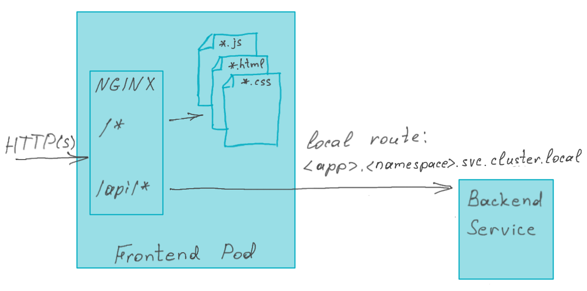

# angular-frontend

angular-frontend provides you an out-of-the-box application setup to fast-start development of a Web Application based
on a Single Page Architecture: the UI is rendered in the browser, the data is retrieved and changed by (RESTful) API calls. Additionally, this aims to model an architecture where the frontend is deeply decoupled from the backend and have individual teams managing their respective components.

It is leveraging Angular as a technology stack, which provides:

- a way to implement UI elements using Components and Binding
- an Inversion of Control Container to wire together your Components and Services
- an integrated Web Server, so no need to deploy the built artifact to a separate running web or application server

The application contains example code to have a first page that lists customer profiles from an API.

It provides ways to test the service and component logic.

## Prerequisites

In order to further develop this application the following tools needs to be set up:

- [NodeJS LTS](https://nodejs.org/) with NPM
- [Angular CLI](https://angular.io/cli) (will be part of the development dependencies of the application)
- Visual Studio Code or JetBrains IntelliJ/WebStorm as Integrated Development Environment (IDE)
- Tanzu Developer Tools plugin for the mentioned IDE

> This application contains only UI and expect several backend services to be available. You can generate a backend based
> on the *Tanzu Java Restful Web App* or *Tanzu CSharp Restful Web App*  Accelerator. Or build your own which shall provide 2 endpoints:
> - GET /api/customer-profiles/ returning an array of customer profiles in the form of  
> ```{"id":"<unique-id>", "firstName":"<first name>", "lastName":"<last name>", "email":"<email>" }```
> - POST /api/customer-profiles/ accepting a customer profile in the form of  
> ```{"firstName":"<first name>", "lastName":"<last name>", "email":"<email>" }```

# Local

Make sure to install dependencies first by executing:

```bash
npm install
```

## Test

It is a good habit to test and execute those tests to see if your application is still behaving as you would expect:

```bash
ng test
```

## Start and interact

Before being able to launch the application one shall configure where the backend services can be found. To do it please update the *target*
property in the `src/proxy.conf.json` file.  
Angular has its own integrated Development Web Server. Launch the application by:

```bash
ng serve
```

### Accessing home page

You can access the public page at `http://localhost:4200/` by a web browser.

# Deployment

## Tanzu Application Platform (TAP)

Using the `config/workload.yaml` it is possible to test, build and deploy this application onto a
Kubernetes cluster that is provisioned with [Tanzu Application Platform](https://tanzu.vmware.com/application-platform).

If your TAP cluster uses a supply chain that has a test step, then you do need to have a test pipeline that supports testing Angular apps.
You can find a sample pipline in the [application-accelerator-samples](https://github.com/vmware-tanzu/application-accelerator-samples/tree/main/angular-frontend/tekton) repo.

### Tanzu CLI

Using the Tanzu CLI you could apply the workload using the local sources:

```bash
tanzu apps workload apply \
  --file config/workload.yaml \
  --namespace <namespace> \
  --local-path . \
  --yes \
  --tail
````

Note: change the namespace to where you would like to deploy this workload.

--- StartAuthorization
### Authorization
If you want to use Tanzu's AppSSO Authorization server, please see `AUTHORIZATION.md` for details.
--- EndAuthorization

### Visual Studio Code Tanzu Plugin

When developing local but would like to deploy the local code to the cluster the Tanzu Plugin could help.
By using `Tanzu: Apply` on the `workload.yaml` it will create the Workload resource with the local source (pushed to an image registry) as
starting point.

## Deployment topology

A running pod of this workload will include a built Angular application, NGINX server and NGINX configuration. A built Angular application
contains set of JavaScript, HTML, CSS and other static files which will be served by the NGINX HTTP server. Additionally, the NGINX server
will act as a reverse proxy, rerouting requests to the backend services. The rerouting rules you can find and adapt in the NGINX configuration
located in *nginx.conf* (see lines 161-163).  
  

## How to proceed from here?

Having the application locally running and deployed to a cluster you could add additional Components, Templates and Services to interact
with your API.
