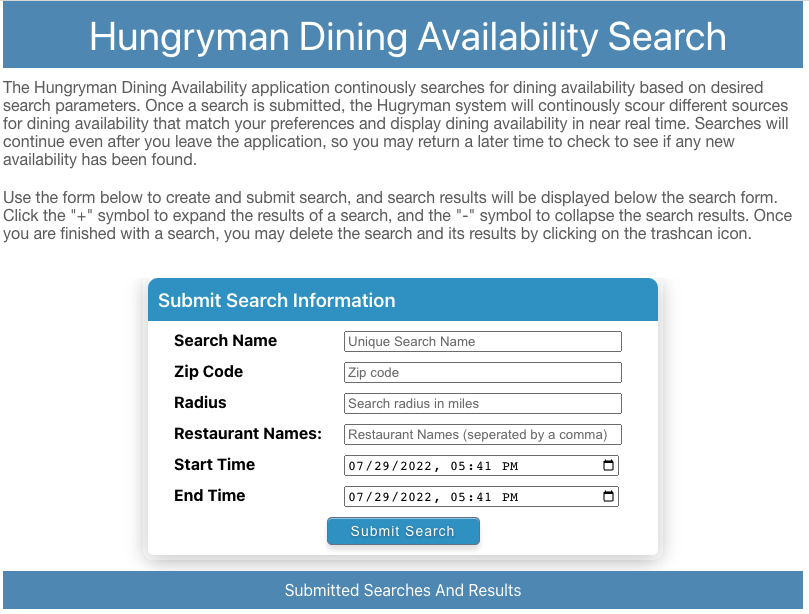

# Tanzu Application Platform (TAP) Deployment

The Hungryman TAP deployment options are enabled through a Tanzu application accelerator that will generate all necessary configuration for you.  

To install the accelerator into your TAP cluster, run the following command:

```
tanzu acc create hungryman --git-repo https://github.com/sample-accelerators/hungryman --git-branch tap-1-3
```

## Prerequisites

These instructions assume that you have a TAP 1.2.x or greater iterate cluster (or some variant similar to an iterate cluster) up and running with the following packages installed and [kubectl](https://kubernetes.io/docs/tasks/tools/) and the Tanzu CLI installed and configured to access your TAP cluster:

* Tanzu TAP GUI
* Tanzu Build Services
* Tanzu Cloud Native Runtimes
* Tanzu Service Bindings
* Tanzu Services Toolkit
* Tanzu Out of the Box Supply Chains
* Tanzu Out of the Box Templates
* Tanzu Source Controller
* Tanzu AppSSO (required if using the `Enable Security` option).

## Quick Start

This section provides a fast track installation of the "simplest" configuration of the Hungry application using the application accelerator and the instructions immediately below.  A more thorough description of the configuration and installation scenarios are describes in subsequent sections of this page.  This section assumes you have already installed the application accelerator using the instructions at the top of the page.

* Install Rabbit MQ operator:

```
kubectl apply -f "https://github.com/rabbitmq/cluster-operator/releases/download/v1.13.1/cluster-operator.yml"
```

* Navigate to your TAP GUI web page and Application Accelerator tab on the left of the screen.  Select the `Choose` button on the `Hungryman` Application

* Select all defaults except change the `workload-namespace` if need be to a namespace that you have already configured to run workloads (e.g. a developer namespace).  Download and unzip the generate accelerator file to you workstation.

* Open a command shell and navigate to the root directory of the unzipped file from above.  Run the following commands to create a RabbitMQ instance, resource claims, and workloads:

```
kubectl create ns service-instances

kubectl apply -f ./config/service-operator/

kubectl apply -f ./config/app-operator/

kubectl apply -f ./config/developer/
```

Depending on previously installed/cached components, network speed/latency, and available cluster compute, the amount of time for the RabbitMQ cluster to spin up and the workloads to build and deploy may vary greatly.  It is possible for the process to take more than 10 minutes in some instances.

Once the applications have been successfully built and deployed, you can get the URL of the Hungryman application by running the following command.  **Note** If need be, change the namespace `workloads` to the namespace where you deployed the applications.

```
tanzu apps workloads get hungryman -n workloads
```

If the application was successfully deployed, you should see a section at the bottom of the command's out similar to the following:

```
Knative Services
NAME        READY   URL
hungryman   Ready   http://hungryman.perfect300rock.com
```

### Monitor and Verify Installation

You can monitor the quick installation steps from above at any point.

**Verify RabbitMQ Operator Install** 

Run the following command to verify that the RabbitMQ operator installed successfully:

```
kubectl get pod -l app.kubernetes.io/component=rabbitmq-operator  -n rabbitmq-system
```

You should see a result similar to the following:

```
NAME                                         READY   STATUS    RESTARTS   AGE
rabbitmq-cluster-operator-6f55c6f5fc-98zrm   1/1     Running   0          30m
```

**Verify RabbitMQ Instance Creation** 

Run the following command to verify that the RabbitMQ instance was created successfully:

```
kubectl get rabbitmq -n service-instances
```

You should see a result similar to the following:

```
NAME            ALLREPLICASREADY   RECONCILESUCCESS   AGE
rmq-hungryman   True               True               55m
```

**Verify Application Build and Deployment**

Run the following command to verify that applications built and deployed successfully.  **Note** If need be, change the namespace `workloads` to the namespace where you deployed the applications.

```
kubectl get workload -n workloads
```

You should see a result similar to the following:

```
hungryman                https://github.com/sample-accelerators/hungryman   source-to-url   True    Ready    58m
hungryman-availability   https://github.com/sample-accelerators/hungryman   source-to-url   True    Ready    58m
hungryman-notify         https://github.com/sample-accelerators/hungryman   source-to-url   True    Ready    58m
hungryman-search         https://github.com/sample-accelerators/hungryman   source-to-url   True    Ready    58m
hungryman-search-proc    https://github.com/sample-accelerators/hungryman   source-to-url   True    Ready    58m
hungryman-ui             https://github.com/sample-accelerators/hungryman   source-to-url   True    Ready    58m
```

## Configuration Option Overview  

Tanzu Application Platform supports various eventing options for deployments.  The two targetted for this application of the following:

* Spring Cloud Streams
* Knative eventing

In addition, the Hungryman application has additional deployment options which consume additional services and/or provide additional functionality.  These include
* H2 (In Memory) vs MySQL vs Postgress database options
* Security enablement with AppSSO

The simplest configuration is to use Spring Cloud Streams; however, using KNative eventing provides for extended capabilities such as scale to zero and auto scaling.  In both options, a Spring Cloud Streams binding implementation is required for moving messages from the `hungryman-search` application; RabbitMQ is the default binding provided.  Neither option requires a change in source code, however different runtime dependencies are configured at build time depending on which eventing implementation is desired.  

For database configuration, the default H2 in memory database is the simplest option and requires no additional database services to be installed, however you will lose all database information with an application restart and can not scale past one instance.  The MySQL and Postgres options give you persistence and scalability, but require you to install a database operator and provision database instances.  

By default, the application has no security.  When choosing the security configuration, you are required to create an AppSSO instance resource as well as a `ClientRegistration` resource for the Hungryman application; the accelerator will generate the resource yaml for you.  You can either use a built in development account, or have the option (in a future release of this accelerator) to connect to external OIDC identity providers.

**NOTE** For the fastest and easiest path to deploying this application, use the default options of the H2 database and no security.  You will still be required to deploy the RabbitMQ operator out of band, however this step is trivial as explained in the `RabbitMQ Operator` section of this guide.

## RabbitMQ Installation

A Spring Cloud Streams binding is a required dependency for Hungryman, and RabbitMQ is the default binding.  Although Hungryman doesn't care where or how your RabbitMQ cluster is deployed, there are relatively simple out of the box solutions, and this guide will cover using a Kubernetes operator for Rabbit MQ.

### RabbitMQ Operator

The RabbitMQ Kubernetes operator provides a resource based option for deploying RabbitMQ clusters to a Kubernetes cluster.  It also has the nicety of supporting the Kubernetes [Service Binding Spec](https://github.com/servicebinding/spec).  To install the RabbitMQ operator, run the following command against your cluster.  Later deployment instructions will assume that your RabbitMQ cluster and the Hungryman application are installed on the same cluster for the purpose of service binding, but this is not technically a requirement.

```
kubectl apply -f "https://github.com/rabbitmq/cluster-operator/releases/download/v1.13.1/cluster-operator.yml"
```

If successfully installed, there will be an RabbitMQ cluster operator pod running in the `rabbitmq-system` namespace.

### RabbitMQ Topology Operator (Experimental)

If you choose to use the KNative eventing deployment option, you will also need to deploy the RabbitMQ Topology Operator.  This operator allows for the declarative creation of resources like RabbitMQ exchanges, queues, and bindings.  The topology operator is a dependency of the KNative RabbitMQ Source resource which will be covered in the next section. 

To install the RabbitMQ Topology operator, run the following command against your cluster. 

```
kubectl apply -f "https://github.com/rabbitmq/messaging-topology-operator/releases/latest/download/messaging-topology-operator-with-certmanager.yaml"
```

### RabbitMQ Eventing Source (Experimental)

If you choose to use the KNative eventing deployment option, you also need to deploy the KNatvie RabbitMQ Eventing Source resources.  The eventing source acts as a bridge between messages emitted by the `hungryman-search` application and the rest of the downstream services.

*NOTE:* The RabbitMQ Eventing source is pre-installed into your TAP deployment if you have chosen to deploy the Cloud Native Runtimes package.  However; TAP versions 1.2.x and below do not have an up to date version that will work with some of the declared resources in these instructions.  These instruction require RabbitMQ Eventing 1.4.0 or later.


## MySQL Installation

The simplest configuration is to have the Hungryman services use an in memory database.  However; the contents of the database will be reset if a pod is restarted or a new revision of the application is deployed.  The default application build supports MySQL as a database target.  Similar to RabbitMQ, MySQL can be deployed in various ways and the services don't care where or how MySQL was installed.  Using a MySQL Kubernetes operator that supports the service binding specification is an optimal option for application deployment.  The Tanzu MySQL for Kubernetes package is one possibility that supports this option, and installation instructions can be found [here](https://docs.vmware.com/en/VMware-Tanzu-SQL-with-MySQL-for-Kubernetes/1.5/tanzu-mysql-k8s/GUID-install-operator.html).


## Service and Application Install

With the necessary and optional operators installed, you are ready to access the Hungryman accelerator and deploy the application.

### Application Accelerator

The Hungryman application accelerator generates configuration files for the various options that you select.  Configuration files will be placed in a `config` directory at the root of the generated file system and grouped together in sub directories by operational persona.  The personas include
* Service Operator: These configuration files are used to provision services such as a RabbitMQ clusters and database instances.
* Application Operator: These configuration files create resource claims and enables the services instances to be visible to the Tanzu CLI `services`	 command.
* Developer: These configuration files contain the workload.yaml files for building and deploying the Hungryman application components to the TAP cluster(s).


#### Accelerator Options
The accelerator contains the following configuration options:

* **Workload Namespace:** The namespace where the application micro-services will be deployed.  It is assumed that this namespace has already been created and has been configured to run TAP workloads.
* **Service Namespace:** The namespace where data service instances like RabbitMQ and databases reside (or will reside once created).  It is assumed that this namespace has already been created.
* **RabbitMQ Cluster Name:**  The name of the RabbitMQ cluster resource that the micro-services will connect to.  If a new RabbitMQ cluster resource is to be created, this will be the name of the resource.  This name will also be propagated to the `workload.yaml` files in the resource claim section to indicate the names of the cluster that micro-services should connect to.
* **Create RabbitMQ Cluster Definition:** If this box is checked, the accelerator will generate a file named `rmqCluster.yaml` in the `config/service-operator` directory that contains the configuration to create the RabbitMQ cluster.
* **Number of RabbitMQ Nodes:** If a RabbitMQ cluster needs to be created, this is the number of replica nodes that will be created.
* **Database Type:** The type of database that will be used for the services to store data.  Current options are H2, MySQL, and Postgres (not yet supported).  If anything other than H2 is selected, you will be asked to configure additional database properties.
* **Database Name:**  The name of the database resource that the micro-services will connect to.  If a new database resource is to be created, this will be the name of the resource.  This name will also be propagated to the `workload.yaml` files in the resource claim section to indicate the names of the database that micro-services should connect to.
* **Create Database Definition:** If this box is checked, the accelerator will generate a file named `mysqlInstance.yaml` in the `config/service-operator` directory that contains the configuration to create the database instance.
* **Create Resource Claim Definition for Service:** If this box is checked, the accelerator will generate configuration yaml file in the `config/app-operator` directory that contain the resource definition for the resource claims that the micro-services can use to create service bindings to external service like RabbitMQ and database.  It also creates resource definitions used by the Tanzu CLI to manage service instances and resource claims. 
* **Enable Security:** If this box is checked, the accelerator configure the applications to use a `secure` profile that will require the UI application authenticate users and for micro-services to require valid oAuth tokens with each request.  The accelerator will also generate a file named `appSSOInstance.yaml` in the `config/service-operator` directory that contains the configuration to create an AppSSO authorization server.  It will also generate a file named `clientRegistrationResourceClaim.yaml` in the `config/app-operator` directory that contains configuration for creating a ClientRegistration resource as well as the resource claims that the micro-services can use to create service bindings to AppSSO instance (via the ClientRegistration).  **NOTE:**  Security is not completely functional at this time.
* **AppSSO Instance Name:**  If security is enabled, the name of the AppSSO resource that the micro-services will connect to.  This name will also be propagated to the `workload.yaml` files in the resource claim section to indicate the names of the AppSOO resource that micro-services should connect to.
* **Issuer URI:**  If security is enabled, this is the full issuer URI used by the AppSSO instance.  This URI will also be used to create `Service` and `HTTPProxy` resources for Ingress to the AppSSO instance.  Make sure the URI is routed to your cluster.  You will likely need to register the host name of the issuer URI with your DNS provider to route to your cluster's Ingress load balancer.
* **Redirect URI:**  If security is enabled, this is the redirect URI back the API gateway service after a successful user authentication.
* **Create Default Dev Account:**  If this box is checked, a default development account will be created that can be used to authenticate with the AppSSO service.
* **Dev Account Username:** The username of the default dev account in the AppSSO instance.
* **Dev Account BCrypt Password:** The BCrypt encoded password of the default dev account in the AppSSO instance.


**NOTE** The default workload namespace is `workloads` and NOT `default`.  Make sure the workload namespace you choose is setup to build and run workloads.

The generated zip file from the accelerator will contain project folders for all micro-services and yaml configuration files for the selected options.  It will also contain a `workloads.yaml` files in the `config/developer` directory that contain configuration data from the choices above that can be used to create the workloads on the cluster.

### Application Deployment

Before deploying the application, an appropriate persona should first deploy any requested configuration items from the section above using the `kubectl` command against each yaml file.  Service operator config should be applied first then application operator config should be applied next.  Run the following commands from the root directory of the exploded accelerator zip file replacing the <services-namespace> with the name of the `Service Namespace` you entered in the accelerator (it was defaulted to *service-instances*):

```
kubectl create ns <services-namespace>

kubectl apply -f ./config/service-operator/

kubectl apply -f ./config/app-operator/
```

Next apply the `workloads.yaml` file to the cluster to create, build, and deploy the workloads.

```
kubectl apply -f ./config/developer/workloads.yaml
```
You can watch the progress of the build and deployment of the applications using the Tanzu CLI.  The following tails the build logs for the hungryman-search application (assuming you used the `workloads` namespace as the workload namespace):

```
tanzu apps workloads tail hungryman-search -n workloads --since 10m --timestamp
```


## Testing the Deployment

Assuming the application has successfully deployed, you can test the application navigating to the application's URL with a web browser.  To can get the URL with the following command and replacing the `<workload-namespace>` placeholder with the namespace that the application has been deployed to.

```
tanzu apps workloads get hungryman -n <workload-namespace>
```

If the application was successfully deployed, you should see a section at the bottom of the command's out similar to the following:

```
Knative Services
NAME        READY   URL
hungryman   Ready   http://hungryman.perfect300rock.com
```

The application's home screen should look similar to the following (assuming you did not enable security).  If you selected to enable security, the home screen will contain a *Login* button.



## Application Catalog

The Hungryman source repo contains a full TAP catalog configuration that is located in the repository's `catalog` directory including API docs links.  You can registry this catalog within TAP by pointing the Repository URL to the URL of catalog-info.yaml file in the `catalog` directory of the repository.  

Ex:

```
https://github.com/sample-accelerators/hungryman/blob/tap-1-3/catalog/catalog-info.yaml
```

**NOTE:** It is highly recommended that you create your own code repository first and then import the catalog from your repository.  You will most likely need update the URLs in the files below to properly import the catalog which contains component API configuration (API Docs). 

To enable API Docs to work correctly with your deployment, you will need to update the API docs URIs in each of the following files by replacing the `$text` element with the URI of your deployment:

```
- catalog
  - components
    - hungryman-availability
      - hungryman-availability.yaml
    - hungryman-search
      - hhungryman-search.yaml
```

You may also be required to enable CORS access in your TAP-GUI configuration in your *tap-values.yaml* file before the catalog will successfully import.  The following is a snippet from the *tap_gui* section of a sample *tap-values.yaml* file.  Pay specific attention to the *reading* section and replace the *host* field with the URL of your deployed Hungryman application.

```
tap_gui:
   .
   .
   .
   app_config:
   .
   .
   .
   backend:
      baseUrl: http://tap-gui.perfect300rock.com
      cors:
        origin: http://tap-gui.perfect300rock.com
      reading:
        allow:
          - host: 'hungryman.perfect300rock.com'      
```

You will need to update your TAP install with the updated tap-values file before the CORS change takes effect.

```
tanzu package installed update tap -n tap-install --values-file tap-values.yaml
```

## Uninstall

To remove the application from your cluster, navigate to the root directory of the unzipped accelerator file and run the following commands to delete all of the created resources:

```
kubectl delete -f ./config/developer/

kubectl delete -f ./config/app-operator/

kubectl delete -f ./config/service-operator/

kubectl delete ns service-instances
```
