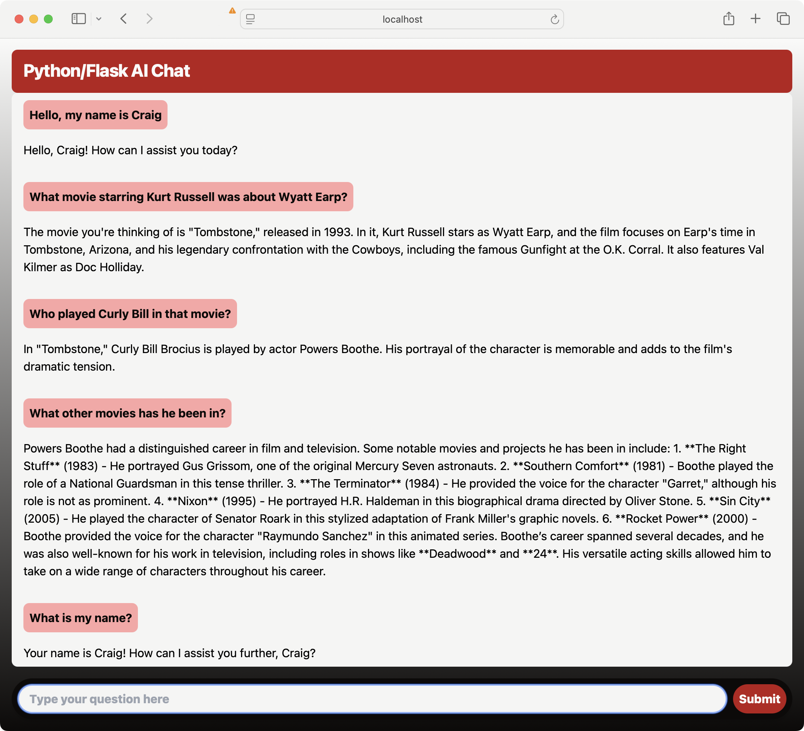

# Python AI Chat

<center></center>

This is an example of a simple web application that a user can use to chat with
an OpenAI-compatible LLM (including OpenAI itself and AI Server).

## Running the application

You will need a Python environment setup. The easiest way to do that (assuming
that you already have Python installed) is to use the venv module (from within
this project directory):

```script
python -m venv .venv
```

Then activate that environment:

```script
source .venv/bin/activate
```

Next you'll need to install the required dependencies:

```script
pip install -r requirements.txt
```

By default, the application works with OpenAI's API (at https://api.openai.com)
using the "gpt-4o-mini" model. But you can override these by setting environment
variables:

```script
export OPENAI_API_BASE_URL=https://some.other.openai.compatible.api/
export OPENAI_MODEL=some-other-model
```

You will also need to set the API key:

```script
export OPENAI_API_KEY=sk-ARm2s...
```

Finally, you can run the application:

```script
python main.py
```

Once started, open your web browser to http://localhost:5000 and chat with the
LLM.

## Tanzu Platform deployment

This section covers how to to deploy and run the application on Tanzu Platform for Cloud Foundry.

### Prerequisites

You need to be logged in to Tanzu Platform for Cloud Foundry and have set the target org and space.

### Create the AI service

Create a new model as a service from the AI Tile. For example, here's how to create a Llama 3.2 model named "myllama":

```
cf create-service genai llama3.2 myllama
```

### Push the app

Then simply push the application to CloudFoundry:

```
cf push
```

The manifest includes instructions for binding the application to a service named 
"myllama". If your model is named differently, edit manifest.yml and change the
service binding to match your model service's name.

### Access the app

Once the application has been deployed and started, open your web browser to the
host that is provided upon completion of `cf push`. From there, you may chat with
the LLM.

You can find the route assigned to the app using this command:

```sh
cf app python-ai-chat
```
The route assigned will be listed under `routes:`.

### Delete the app

To delete the app and remove the assigned route, run the following command:

```sh
cf delete python-ai-chat -r
```

To delete the service, run this command:

```sh
cf delete-service myllama
```


