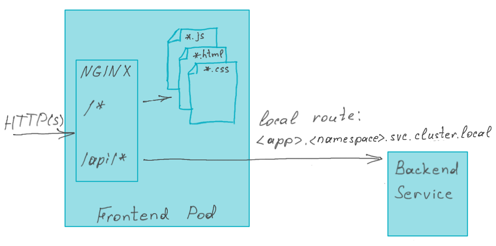

# react-frontend

react-frontend provides you an out-of-the-box application setup to fast start development of a Web Application based
on a Single Page Architecture: the UI is rendered in the browser, the data is retrieved and changed by (RESTful) API calls.

It is leveraging ReactJS as a technology stack, which provides:
- a way to implement UI elements using Components
- a way to re-use Components with Properties and State
- an integrated Web Server for local development, so no need to (re)build the artifact to a separate running web server

## Software Architecture
This simple application contains two pages: one showing a list of customer profiles and another one which can be used
to create a new customer profile. The data is supplied by a backend through a REST API.

The application showcases several ReactJS best practices:
1. Separation between JSON structure (which is used to transfer data over wire) and a typesafe domain object to work with within the app. 
This can be seen in `CustomerProfileService.ts` which is responsible for retrieving and posting `CustomerProfile` data: therefor it maps the DTO to the Domain Object.

2. Separation between representational components and components responsible for a communication with backend. The former ones
are responsible for rendering UI and providing a proper layout. They can be easily tested without any mocks needed.
The components responsible for communication with a backend can be tested by mocking the service modules.
    - `Navigation`, `PageHeader` and `ErrorMessage` are examples of re-usable components as they do not have any domain knowledge
    - `CreateCustomerProfileForm` and `CustomerProfilesTable` are example of re-usable components for domain objects, but are only responsible for representation. Any data needed is given by properties, 
   and any handling needed upon user action are delegated to actions provided by properties.
    - `CreateCustomerProfilePage` and `CustomerProfiles` are components responsible for controlling actions with services.

3. Usage of consumer-driven tests to test communication with API.
    - The `CustomerProfileService` is tested by leveraging Pact: an integration test that bootstraps a local webservice that responds with predefined responses. This 
   way the backend service is tested fully without setting up a whole test environment.

## Prerequisites
In order to further develop this application the following tools needs to be setup:
- NodeJS LTS (https://nodejs.org/) with NPM
- Visual Studio Code or JetBrains IntelliJ/WebStorm as Integrated Development Environment (IDE)
- Tanzu Developer Tools plugin for the mentioned IDE

> This application contains only UI and expect several backend services to be available. You can either generate a backend based
> on the *Tanzu Java Restful Web App* Accelerator. Or build your own which shall provide 2 endpoints:
> - GET /api/customer-profiles/ returning an array of customer profiles in the form of  
    > ```{"id":"<unique-id>", "firstName":"<first name>", "lastName":"<last name>", "email":"<email>" }```
> - POST /api/customer-profiles/ accepting a customer profile in the form of  
    > ```{"firstName":"<first name>", "lastName":"<last name>", "email":"<email>" }```

# Local

## Run NPM install

```bash
$ npm install
```

## Test
It is a good habit to test and execute those tests to see if your application is still behaving as you would expect:

```bash
$ npm test
```

## Start and interact
Before being able to launch the application one shall configure where the backend services can be found. To do it please update the *proxy*
property in the `package.json` file.

React has its own integrated Development Web Server. Launch the application by:
```bash
$ npm start
```

### Accessing home page
You can access the public page at `http://localhost:3000/` by a web browser.

# Deployment
## Tanzu Application Platform (TAP)
Using the `config/workload.yaml` it is possible to test, build and deploy this application onto a
Kubernetes cluster that is provisioned with Tanzu Application Platform (https://tanzu.vmware.com/application-platform).

Before deploying your application a Tekton Pipeline responsible for the testing step should be created in your application
namespace. To support [Pact](https://docs.pact.io/)-based consumer-driven contract testing Python and GCC should be available on an environment where
tests are executed. You need to create a Docker image which provides this kind of environment. You can use a Docker file
available in the `config/Dockerfile` to create one. Please go the `config` directory and execute use following commands.

> Be aware that you have to login to the image registry of your choice beforehand and you must have a write access to this registry.

> **Note:** The image that is created must be an `amd64` image so you can not build this on a system with an ARM processor like the newer Apple systems with M1 or M2 processors.

```bash
 docker build -t <your-image-registry.io>/<your-developer-namespace-project>/react-test-with-pact:node-19 - < Dockerfile
 docker push <your-image-registry.io>/<your-developer-namespace-project>/react-test-with-pact:node-19
```

Please ensure that an image which referenced in the pipeline definition (`config/react-test-pipeline.yaml` line 24) is the same
as the one you created on the previous step. To create a pipeline you can use following command.

```bash
kubectl apply -f config/react-test-pipeline.yaml
```

> One can have several pipelines available simultaneously. Matching of a pipeline with a workload is done based on a label assign to a pipeline.  
> Pipeline:
> ```
> apiVersion: tekton.dev/v1beta1
> kind: Pipeline
> metadata:
>   name: react-test-pipeline
>   labels:
>     apps.tanzu.vmware.com/pipeline: test-react
> ...
> ```  
> Workload:
> ```
> apiVersion: carto.run/v1alpha1
> kind: Workload
> ...
> spec:
>   params:
>     - name: testing_pipeline_matching_labels
>       value:
>         apps.tanzu.vmware.com/pipeline: test-react
> ``` 

### Tanzu CLI
Using the Tanzu CLI one could apply the workload using the local sources:
```bash
tanzu apps workload apply \
  --file config/workload.yaml \
  --namespace <namespace> --source-image <image-registry> \
  --local-path . \
  --yes \
  --tail
````

Note: change the namespace to where you would like to deploy this workload. Also define the (private) image registry you
are allowed to push the source-image, like: `docker.io/username/repository`.

### Visual Studio Code Tanzu Plugin
When developing local but would like to deploy the local code to the cluster the Tanzu Plugin could help.
By using `Tanzu: Apply` on the `workload.yaml` it will create the Workload resource with the local source (pushed to an image registry) as
starting point.

## Deployment topology
A running pod of this workload will include a built React application, NGINX server and NGINX configuration. A built React application
contains set of JavaScript, HTML, CSS and other static files which will be served by the NGINX HTTP server. Additionally to it the NGINX server
will act as a reverse proxy rerouting requests to the backend services. The rerouting rules you can find and adapt in the NGINX configuration
located in *nginx.conf* (see lines 161-163).  



# How to proceed from here?
Having the application locally running and deployed to a cluster you could add additional Components and Services to interact
with your API.

# Resources
- [Tanzu Application Platform](https://tanzu.vmware.com/application-platform)
- [Tanzu Web Servers Buildpack](https://docs.vmware.com/en/VMware-Tanzu-Buildpacks/services/tanzu-buildpacks/GUID-web-servers-web-servers-buildpack.html)
- [Create React App documentation](https://facebook.github.io/create-react-app/docs/getting-started)
- [React documentation](https://reactjs.org/)
- [Pact Foundation](https://github.com/pact-foundation) - Consumer Driven Test Framework
