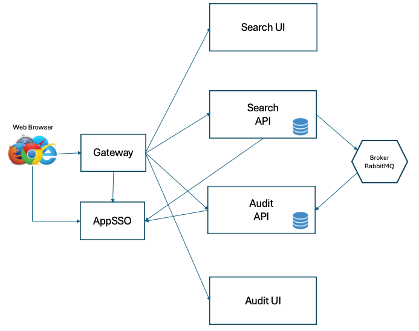

# Secure Spring Resource Server - Postal Code Search


## Deployment Guides

The postal code search and audit applications can technically be deployed on almost any Cloud Native Buildpack enabled platform.  Below are detailed deployment instructions for Tanzu Application Platform:

* [Tanzu Application Platform](doc/TAPDeployment.md)


## Description
The postal code search solution is a multi micro-service application that focuses on a secured resource server implementations. In addition, in has an option to rate limit requests on a 
per prinicipal basis.  Components include:


* An application/API gateway (Spring Cloud Gateway)
* VueJS Web Front Ends
* Reactive REST Web Services (WebFlux)
* Reactive Database Access (R2DBC)
* Asynchronous Eventing (Spring Cloud Streams and RabbitMQ)
* Security (oAuth and Tanzu AppSSO)

## Use Case

The value proposition of the postal code search solution is three fold:

* Search for the latitude/longitude of a given postal code using web app modality.  The front application can then display a map of the location.
* Search for the latitude/longitude of a given postal code using a B2B API through a command line application.
* View audit events generated from postal code searches.

Users of the search web app must login and are either granted a premium or freemium account.  Premium accounts have access to search all US postal codes whilst freemium
users only have access to half of the US post codes.  Each search attempt is audited with a status of either `SUCCESS`, `ERROR`, or `CODE NOT FOUND` and stored in the 
`audit` service.  

The search command line app uses a B2B style API vs a 3 legged oAuth workflow.  Supported auth models are:

- oAuth `client_credential` flow
- API Key (Coming Soon)

Users of the audit viewer web app must login with an account that has a `SECURITY_OFFICER` role.  Any attempt to search for audit events with a non security officer account
will result in an error message when attempting to search for events.

## Application Architecture

The postal code solution consists of the follwoing services/workload:

* A gateway (Commercial Spring Cloud Gateway)
* An authorization servdr (AppSSO)
* A search UI service (`postal-code-search-ui`)
* An API service searching postal code geolocation (`postal-code-search`)
* An auidit viewer UI service (`audit-ui`)
* A service that stores audit events provides an API to search for events by a date/time range.

It also includes a command line application that also allows searching for postal code geo location information.



## Testing Spring Services Locally

The `postal-code-search` service can be configured to use an authorization server; it can also run without it.  The audit service requires
an authorization server which can be configured either by updating the `${POSTAL_CODE_ISS_URL}` parameter in the application.yaml file or by
setting a `POSTAL_CODE_ISS_URL` environment variable with the value of an auth server issuer URL.  

The `postal-code-search` service can be configured in a similar manner, however it requires that the `oauth2` profile be activated to turn on security.  
The requirement to explicitly activate the `oauth` profile is due to future iterations of the service supporting other auth configurations such as
using an API KEY vs oAuth.

Examples:

**Run The Audit Service**

```
export POSTAL_CODE_ISS_URL=http://myauthserver.com/
cd audit
mvn spring-boot:run
```

**Run The Search Service Without Auth**

```
cd postal-code-search
mvn spring-boot:run
```

**Run The Search Service With Auth**

```
export POSTAL_CODE_ISS_URL=http://myauthserver.com/
cd postal-code-search
mvn spring-boot:run -Dspring-boot.run.profiles=oauth2
```
