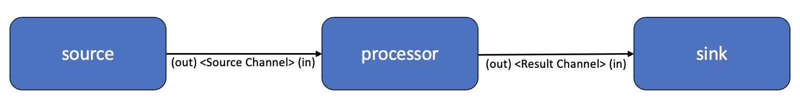

# Streaming App Template

## Description

The Streaming App Template is an application accelerator for quickly generating a starter application that implements aspects of a larger streaming application
using [Spring Cloud Streams](https://docs.spring.io/spring-cloud-stream/docs/current/reference/html/) concepts.  A generated application will take on traits of one of the following streaming application roles:

- Source: Source application that generates new events
- Processor: Processing application that performs business logic on events from the sources and sends them onto a sink
- Sink: Sink application that persists of performs some type of final operation on processed events.

The generated application contains source code and configuration needed for each trait as well as a default event model object.  Typically a developer will use
the accelerator to generate an application for each stream role.

## Usage

The application accelerator generates a starter project based on selected configuration options.  These options include:

* **Name:**  The name of the workload/project that will be created.  The spring.application.name will also reflect this option.
* **Maven Group Name:** The maven group name used for a build application.
* **Service Root Package Name:**  The base Java package name used for the application.
* **Application Main Class Name:**  The name of class that will be used as the SpringBoot main class.
* **Model Class Name:**  The name of class that will be used for the model object that implements the event passed between the applications.
* **Application Role:** Determines the stream role of the generated application.  It can be a `source`, `processor`, or `sink`.  Appropriate configuration and code will be produced for the selected role.
* **Event Source Channel:** If the application is an event source or processor, this is the name of the messaging channel for the source event object. 
* **Event Source Channel Group:** If the application is an event processor, this is the name of the messaging group for the source event object. 
* **Event Result Channel:** If the application is an event processor or sink, this is the name of the messaging channel for the processing result object. 
* **Event Result Channel Group:** If the application is an event sink, this is the name of the messaging group for the processing result object. 
* **Message Broker Name:** The name of the message broker that will be used for service binding.  This is generally the name of a `ClassClaim`. 

## Project Layout

The generated application will have the following layout; function classes will be generated based on the selected application role:

```
pom.xml
 + - src/main/java
     + - resources
         | application.yaml
     + - <package root>
         | - <MainApplciationClass>.java  
         + - functions
             | - <Model>Process.java
             | - <Model>Source.java
             | - <Model>Sink.java
             + - model
                 | <EventModelClass>.java
```

## Application Function

By default, a source application generates a new event using a `PollableBean` method that simply return a new instance of the event model class (by default, a new event is
generated every second).  The processor simply logs out a message that the event was received and returns the event unmodified.  Lastly, the sink outputs that the 
processor result was received.

The following diagram illustrates the complete message flow from the source to the sink.



## Application Creation

You can use this accelerator to generate a project for each roles.  An example workflow would be:

* Create a source application setting the `Event Source` channel, `Event Model`, and `Message Broker Name`
* Create another application using the same settings but choosing `Processor` instead of  `Source` as the role and adding a setting for the `Event Source Group` channel group and `Event Result` channel.  You also need to change application name.
* Create another application using the same settings but choosing `Sink` instead of `Processor` as the role and adding a setting for the `Event Result Group` channel.  You also need to change application name.

## TAP Deployment Guide

The streaming sample applications connect to a RabbitMQ broker for sending and receiving messages.  You will need to create a `ClassClaim` that matches the name of the 
`Message Broker Name` option.  To create the `ClassClaim` as well as a RabbitMQ instance, run the following command updating the <NAME> placeholder with the name
of the message broker and the <WORKLAOD_NAMESPACE> with the name of the namespace where the application will be deployed.

```
tanzu service  class-claim  create  <NAME>  --class rabbitmq-unmanaged -n <WORKLAOD_NAMESPACE>
```

After the `ClassClaim` is created, you can build and deploy the each application by navigating to the root directory of the accelerator generated project and run the following 
command:

```
tanzu apps workload create -f config/workload.yaml --local-path .
```

## Testing

This testing scenario assumes that you have deployed a workload for each application role.

The source application will emit a message everyone one second.  View the logs of the source application and confirm that you see a message similar to the following:

```
Supplier generating new com.example.tanzu.streamtemplate.model.Foo
```

The processor application will receive the message and pass it along unmodified to the sink.  View the logs of the source application and confirm that you see a message 
similar to the following:

```
Processing incoming com.example.tanzu.streamtemplate.model.Foo
```


The sink application will receive the processed message and perform a no-op.  View the logs of the sink application and confirm that you see a message 
similar to the following:

```
Storing incoming com.example.tanzu.streamtemplate.model.Foo in sink
```

## Spring Cloud Data Flow Compatibility

The applications generated by this accelerator are compatible with conventions used by [Spring Cloud Dataflow](https://dataflow.spring.io/) and should work without additional modifications 
to the source code or changes to the configuration in the application.yaml file.
