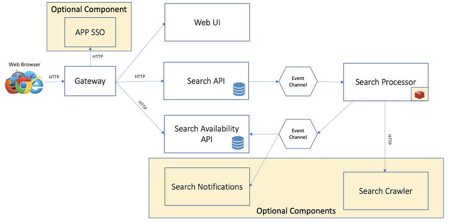
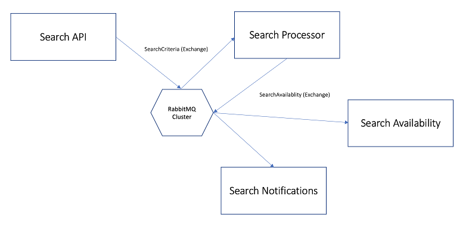
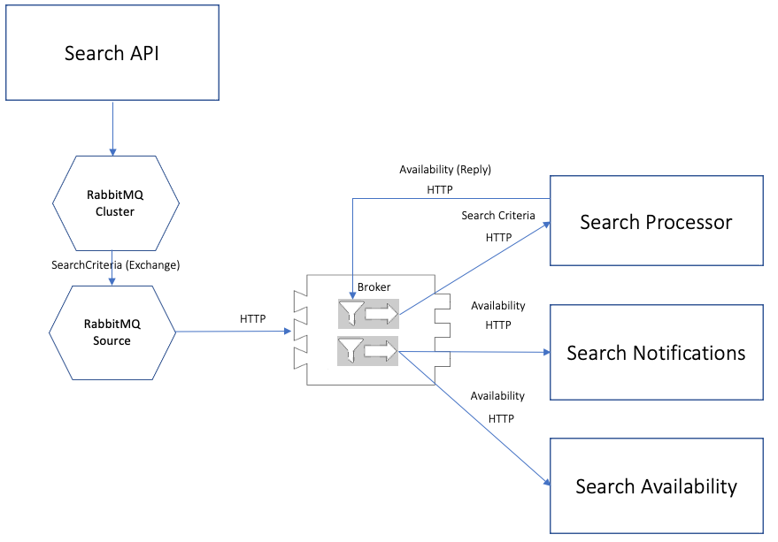

# Where for Dinner

## Deployment Guides

The Where for Dinner application can technically be deployed on almost any Cloud Native Buildpack enabled platform.  Below are detailed deployment instructions for various platforms:

* [Tanzu Application Platform](doc/TAPDeployment.md)
* Tanzu Application Services (TBD)
* Azure Spring Apps Enterprise (TBD)

## Description
The Where for Dinner dining search solution is a multi micro-service application that implements a relatively contemporary architecture comprised of the following technologies:

* An application/API gateway (Spring Cloud Gateway)
* ReactJS Web Front End
* Reactive REST Web Services (WebFlux)
* Reactive Database Access (R2DBC)
* Asynchronous Eventing (Spring Cloud Streams and Functions)
* State (Redis)
* Security (oAuth and Tanzu AppSSO)

Along with Spring Cloud Stream, CloudEvents and Knative eventing are supported as an alternative deployment option with a small change in application dependencies (but no source code changes).  This alternative deployment method also supports Knative scale to zero as well as auto scaling. 

The default application configuration supports static out of the box data sets; however, is also contains options to configure alternative data sources.  Lastly, the asynchronous messaging model supports the ability to add applications to the extend functionality.

## Use Case
The value proposition of the Where for Dinner application is to search for availability at dining establishments.  Unlike other search applications that provide on-demand results of dining availability in real time, Where for Dinner attempts to ease the frustration of obtaining reservations at establishments that have limited availability (i.e. they are hard to get into).  Real time searches at these types of establishment tend to always show no availability and forces a user to either continually hit a *search* button or come back to the reservation site multiple times to check if availability has opened. This is where Where for Dinner steps in; it takes a set of search parameters such a time window, establish name, establishment type, and/or zip code and continually searches for availability on the users behalf.  The user can come back at a later time and check to see what availability the application has found.  Where For Dinner continues searching and updating availability results as they change.  A real time event module can also be added that sends real time notifications to a user over a configured medium such as SMS, email, or a proprietary application.

## Application Architecture

Where for Dinner consists of five main service modules:

* A gateway (`where-for-dinner-api-gateway` or Commercial Spring Cloud Gateway)
* A web UI service (`where-for-dinner-ui`)
* An API service for submitting search requests (`where-for-dinner-search`)
* A processor service for executing searches against availability sources and managing results (`where-for-dinner-search-proc`)
* An API service that stores and provides access to availability results (`where-for-dinner-availability`)

Where for Dinner also has two optional components:

* A crawler service that collects establishment availability and provides a query API (`where-for-dinner-crawler` or `where-for-dinner-crawler-python`)
* A real time notification service that publishes availability to configured destinations (`where-for-dinner-notifiy`)

The high level data flow looks like the following:

Note that the event channel protocols are not specified as they can be swapped out with different implementations.  By default, the application uses the RabbitMQ binding for Spring Cloud Streams, but could be swapped for any supported binding.  Because the channel end points are implements as Java `functions`, they are support `CloudEvents` and the event channels can be orchestrated through other mechanisms such as Knative eventing.  As you will see later on, there are provided deployment configurations in this repository for RabbitMQ service binding and Knative eventing.

### Spring Cloud Streams Implementation

The default build and deployment architecture uses Spring Cloud Streams as the asynchronous messaging implementation with RabbitMQ as the default binding.  The messaging topology is depicted in the following abridged architecture diagram: 

### Knative Eventing 

The *Cloud Events* option of the Where For Dinner application contains build configuration that removes Spring Cloud Streams dependencies and relies on the Spring Cloud Function webflux library for receiving events over HTTP.  Knative eventing fully embraces this paradigm and integrates seamlessly with functions exposed via the Spring Cloud Functions module.

The architecture still uses Spring Cloud Streams as the messaging implementation for initially emitting searches, and a Knative `source` is inserted to create a bridge between the Spring Cloud Streams binding and the downstream Knative eventing concepts.  For the RabbitMQ implementation, a Knative RabbitMQ Source is declared to read events from a RabbitMQ exchange and propagate them through Knative eventing down to the subscribing services.  The following is a diagram of the Knative event concepts used for Where For Dinner:

  

