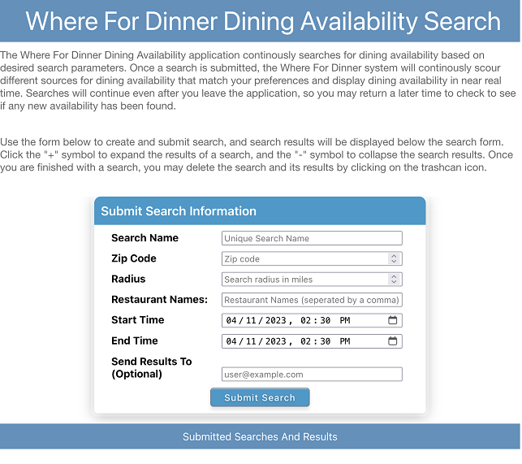

# Azure Spring Apps Deployment

## Prerequisites

These instructions assume that you have an Azure Spring Apps Enterprise Tier service already provisioned

* [Azure CLI version 2.42.0 or higher](https://docs.microsoft.com/cli/azure/install-azure-cli?view=azure-cli-latest)
* [Azure CLI spring extension](https://learn.microsoft.com/en-us/cli/azure/spring)

## Quick Start

This section provides a fast track installation of the "simplest" configuration of the Hungry application using the
application accelerator and the instructions immediately below. A more thorough description of the configuration and
installation scenarios are describes in subsequent sections of this page

* Configure Azure CLI defaults to shorten commands

```shell
az configure --scope local --defaults group=$RESOURCE_GROUP location=$LOCATION spring=$ASA_INSTANCE_NAME
```

* Provision Azure Service Bus:

```shell
    az servicebus namespace create --name where-for-dinner
    az servicebus topic create --namespace-name where-for-dinner --name where-for-dinner-search-result
    az servicebus topic create --namespace-name where-for-dinner --name where-for-dinner-search-criteria
    az servicebus topic subscription create --namespace-name where-for-dinner --topic-name where-for-dinner-search-result --name where-for-dinner-search-result-group
    az servicebus topic subscription create --namespace-name where-for-dinner --topic-name where-for-dinner-search-result --name where-for-dinner-notify-group
    az servicebus topic subscription create --namespace-name where-for-dinner --topic-name where-for-dinner-search-criteria --name where-for-dinner-search-criteria-group
```

* Create Apps

```shell
    az spring app create -n availability
    az spring app create -n crawler
    az spring app create -n notify
    az spring app create -n search
    az spring app create -n search-proc
    az spring app create -n app-ui
```

* Create Service Connections

```shell
    az spring connection create servicebus --app availability --tg $RESOURCE_GROUP --namespace where-for-dinner -g $RESOURCE_GROUP --client-type springBoot --service $ASA_INSTANCE --secret 
    az spring connection create servicebus --app notify --tg $RESOURCE_GROUP --namespace where-for-dinner -g $RESOURCE_GROUP --client-type springBoot --service $ASA_INSTANCE --secret 
    az spring connection create servicebus --app search --tg $RESOURCE_GROUP --namespace where-for-dinner -g $RESOURCE_GROUP --client-type springBoot --service $ASA_INSTANCE --secret 
    az spring connection create servicebus --app search-proc --tg $RESOURCE_GROUP --namespace where-for-dinner -g $RESOURCE_GROUP --client-type springBoot --service $ASA_INSTANCE --secret 
```

* Deploy Apps

```shell
    az spring app deploy -n availability --source-path where-for-dinner-availability
    az spring app deploy -n crawler --source-path where-for-dinner-crawler
    az spring app deploy -n notify --source-path where-for-dinner-notify
    az spring app deploy -n search --source-path where-for-dinner-search
    az spring app deploy -n search-proc --source-path where-for-dinner-search-proc
    az spring app deploy -n app-ui --source-path where-for-dinner-ui --build-env BP_WEB_SERVER=nginx BP_NODE_RUN_SCRIPTS=build BP_WEB_SERVER_ROOT=build BP_WEB_SERVER_ENABLE_PUSH_STATE=true
```

* Define Gateway Routes

```shell
    az spring gateway route-config create --name availability-routes --app-name availability --routes-file routes/where-for-dinner_availability_route.json
    az spring gateway route-config create --name search-routes --app-name search --routes-file routes/where-for-dinner_search_route.json
    az spring gateway route-config create --name app-ui-routes --app-name app-ui --routes-file routes/where-for-dinner_ui_routes.json
```

* Configure Spring Cloud Gateway

```shell
az spring gateway update --assign-endpoint true
export GATEWAY_URL=$(az spring gateway show | jq -r '.properties.url')
    
az spring gateway update \
    --server-url "https://${GATEWAY_URL}" \
    --allowed-origins "*" \
    --allowed-methods "*" \
    --allowed-headers "*" 
```
--- StartSecurity
## Configure SSO for Spring Cloud Gateway

Enable SSO on Spring Cloud Gateway:

```shell
az spring gateway update \
    --client-id ${CLIENT_ID} \
    --client-secret ${CLIENT_SECRET} \
    --scope sso-scope \
    --issuer-uri issuer-uri 
```

--- EndSecurity
## Testing the Deployment

* Access Application Using Spring Cloud Gateway

Assuming the application has successfully deployed, you can test the application navigating to the application's URL with a web browser.  To can get the URL with the following command:

```shell
    az spring gateway show | jq -r '.properties.url'
```
The application's home screen should look similar to the following (assuming you did not enable security).  If you selected to enable security, the home screen will contain a *Login* button.

